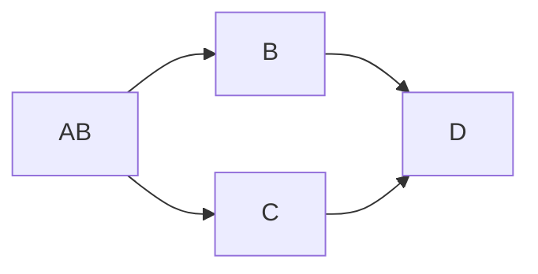

# Arena

CodeIT Suisse 2021, 2022 judge for question Arena, a real time boardgame playing question on tic-tac-toe, quoridor and connect 4

## Question Philosophy

REST API might be too trivial for candidates, let's try SSE. I think SSE is not as famous as websocket, so developing in SSE can introduce them this new great thing.

I was planning to make participants to compete with each other, but first I need to make sure the participants can make valid movements, so I come up with an idea that participants should be able to validate the input from opponent, so a designed a lot of cheat actions to be sent from our AI. The main testing area is not building an AI, so I set up lose time limit, to allow them to build whatever tools they can, to streamline their response time, and not limited to building an actual AI agent, of course, they are welcomed to build an AI, they are even welcomed to modify code to existing opensourced projects, or call some external API, if they can find oue.

## How the platform is built

