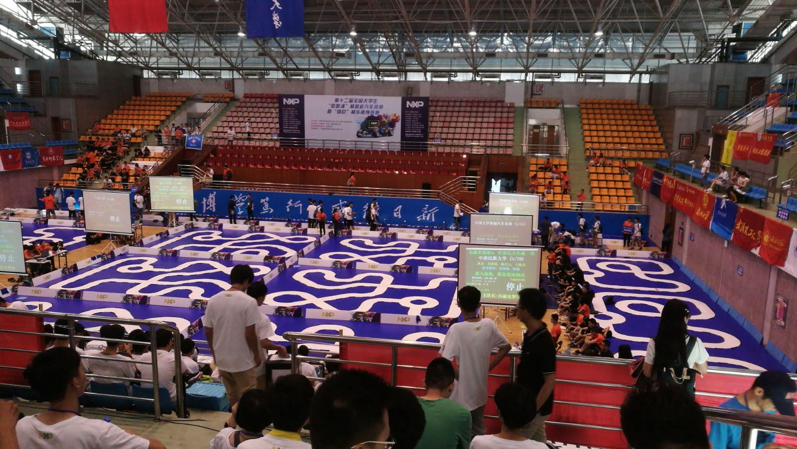
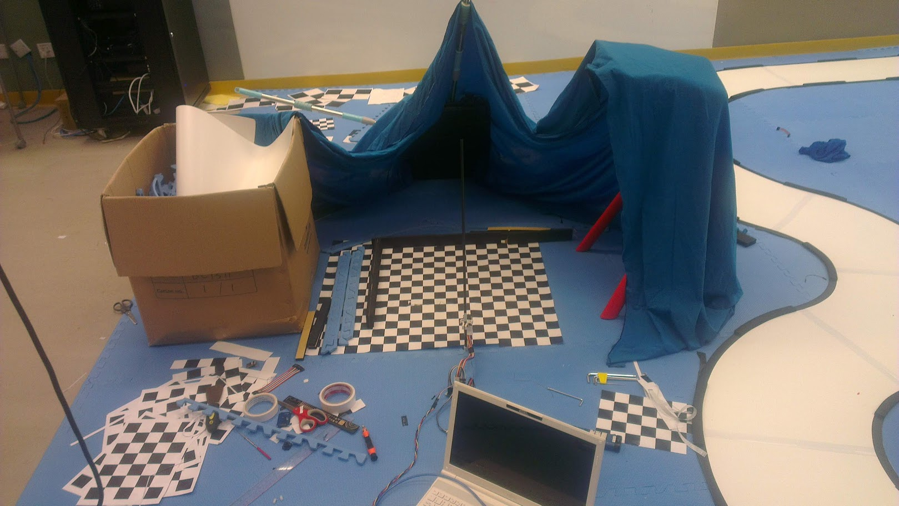
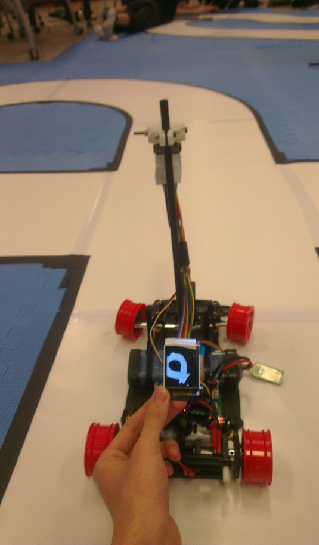
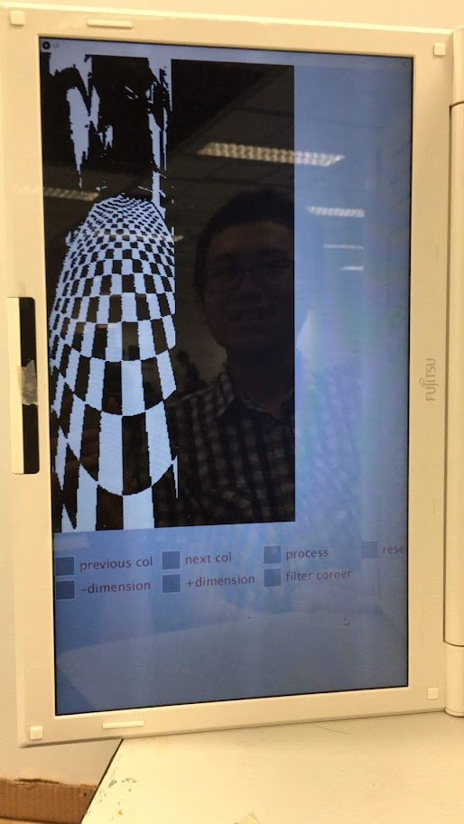
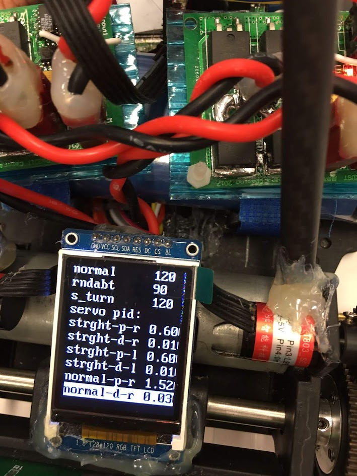

Chasing is a subteam in smart car competition 2017. We need to build two smart cars that have a camera sensor the look at the road, run at the same time, and perform overtaking.

## About robotics team smart car competition

<iframe width="560" height="315"
        src="https://www.youtube.com/embed/XNHxQgQYgy0?si=2VbYpy3ngVnYVlLf"
        frameBorder="0"
        allowFullScreen
/>

