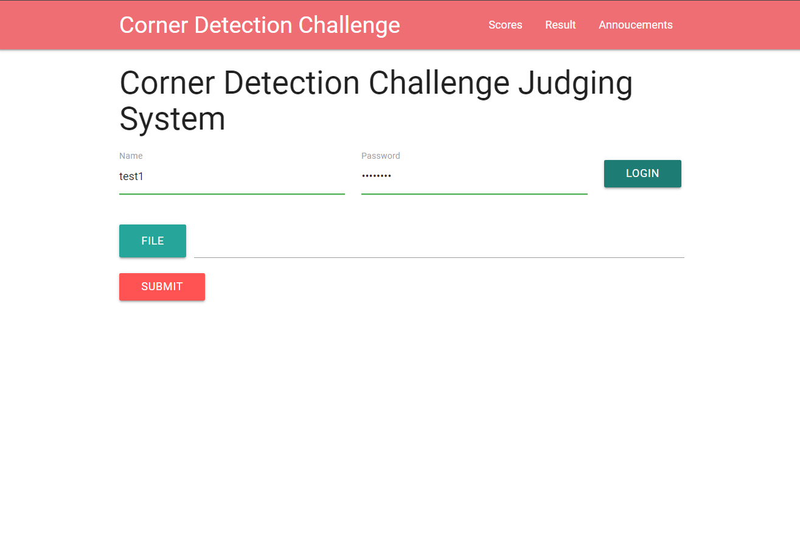
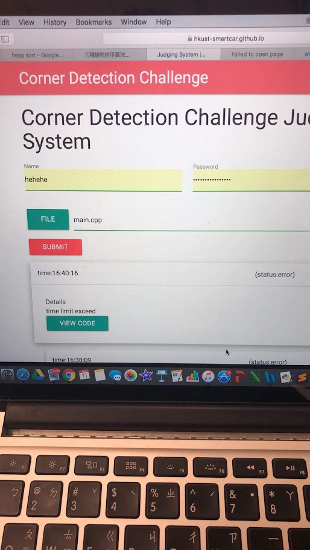
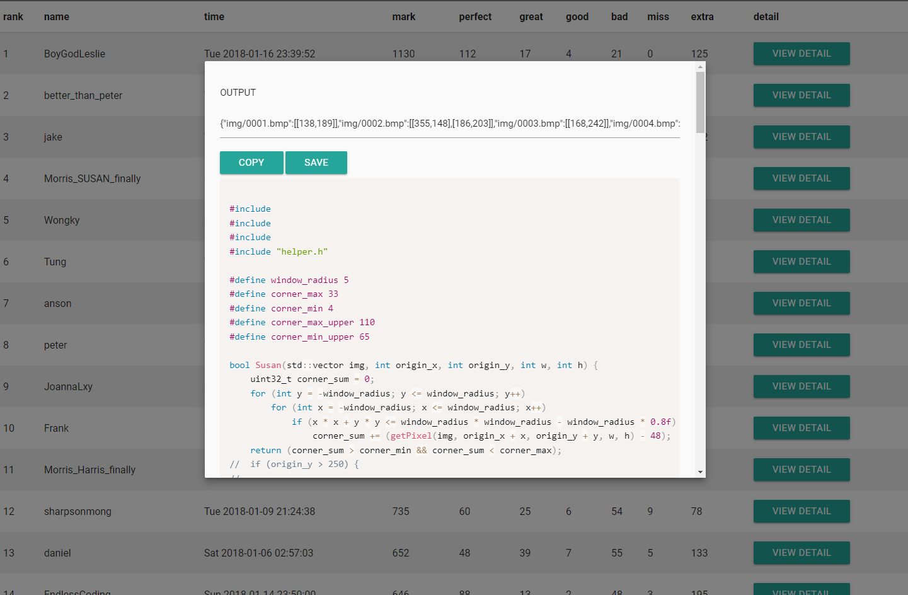
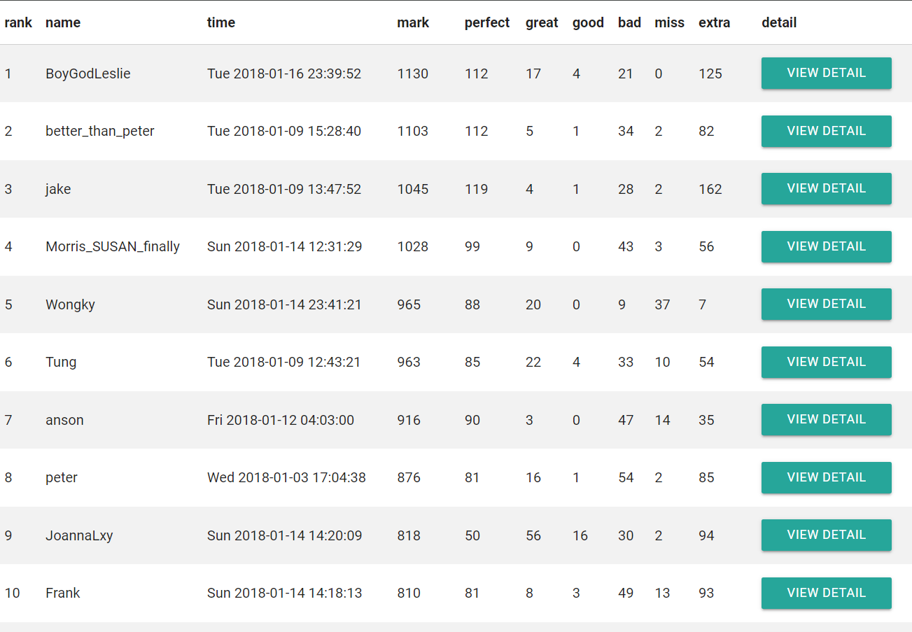
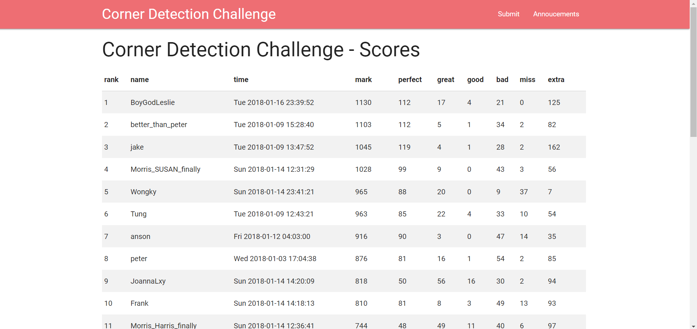
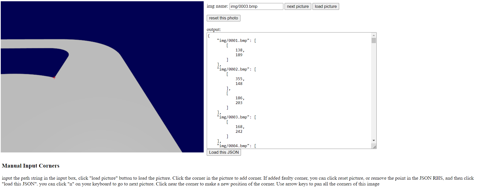

## Story

I was a senior member in HKUST Robotics team smart car subteam and we are training our new joiners with corner detection - an esssential element when doing computer vision algorithms. As grading their quality in corner detection is not quite feasible with hands, I developed this system to automate their attempts in processing track images.

## Screenshot

> Homepage, where users can login and submit their code

> Leaderboard

> Admin result browser

> Test case preparation and result visualizer

## Technology

- Frontend: VueJS, Materialize.css
- Backend: PHP
- Database: Firebase, Skygear

Note: Skygear stopped their service so the site no longer works

## Working principles

CAUTION: It is strange because I was a web dev newbie, I have no convention in mind so I just hack the way through to make the system works

- Skygear manages user authentication
- When user upload file, it save the record and file to firebase, and publish a message through Skygear
- On my own laptop, open an admin panel (which is a frontend project) and start an apache server that hosts php files. The admin panel subscribe to Skygear channel, when there is a grading request coming, it download the code from firebase, and upload the php server, the php server compile the file, run the exe against all bmp test cases, return the result to admin panel, then admin panel save the result to firebase, and publish through Skygear. I would never do the same like this.

## Lessons

1. DO NOT USE SKYGEAR.

  Yes I can immediately draw this conclustion after working on this project. I was using skygear just because I learned it from USThing workshop and it has the pub sub and authentication feature I wanted. However, I dont need to use Skygear for this, I can simply use Firebase. Skygear API just unstable so I switch some part of its usage to firebase in the midway, and there was not enough documentation. Because of this lesson, my coming projects are using firebase, for example [SpyFall](/posts/SpyFall) and [ScoreBoard](/posts/ScoreBoard) and it has been happy working with firebase. And at the end Skygear just no longer live and luckily this is the only project I depend on Skygear.

1. I need to learn a better way set up backend service.
  
  The way I did the grading part using frontend and dedicated the code grading part to a php. This is not scalable because one must keep their laptop on to keep the grading going - browser webpage is difficult to be hosted on an ordinary server. But that time I dont have knowledge on getting a linux server/ AWS/ or other hosting service, all I can utilize is my own laptop so I would say it is normal for me to made that decision. If I had to make the same service again a would make a proper backend and that is why [Judge2](/posts/Judge2) came.

Anyway the goal of having junior to learn corner detection is well archieved and they made a good result in coming smart car competition.