design connectivity
frontend connection

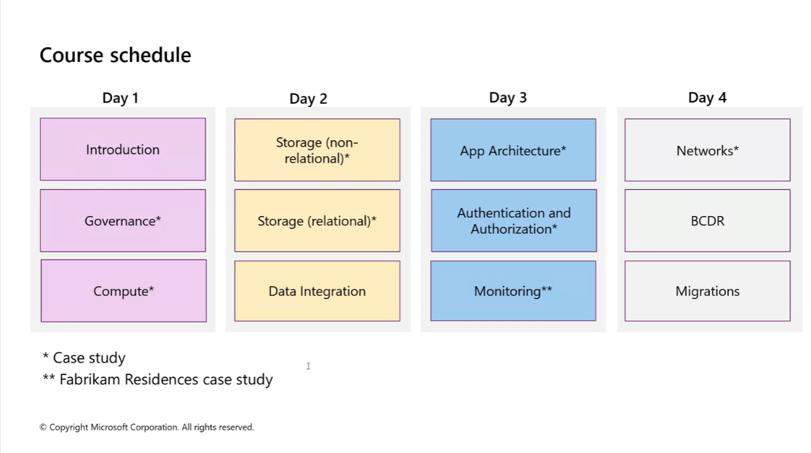

## Goverance

pim - prevalage identity managment

users can raise request to create vm but need approver approve

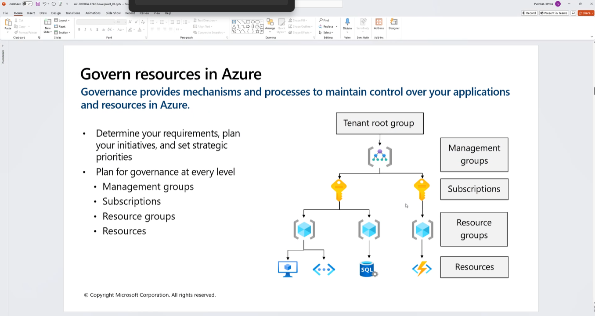

default management group always available

location base / team base / env based management group

subcloud subscription 

common to have multiple subscription - good practise

separate requirement

vm plans (cpu counts) different in different subscription policy / compliance policy

each env 2 subscription

compliance setting (azure policy) at resource group, sometime resource group, not tenant group

ensure backup by policy (azure policy)

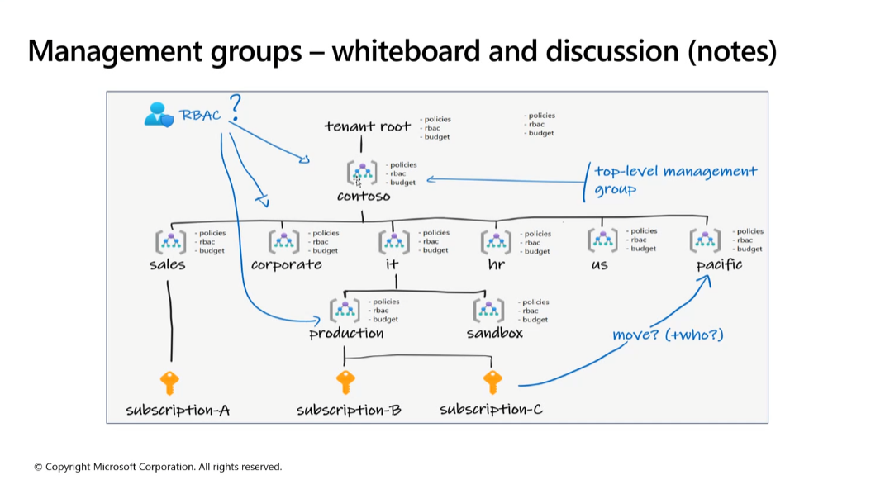

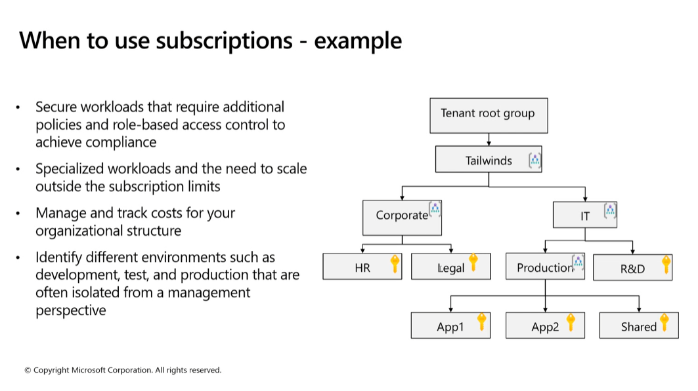

^ no applying to real life, too complicated

not so common: every product has their own subscription.

control every product has what resource

common: two subscriptions - prod, dev

## Azure policy RBAC

policy go resource group level better than subscription level

what policy available?

- location (allowed location and allowed location for resource group are the same)

can select which kind of resource that has effect, like vm and db, then vpn/network/etc are not affected

5-15 minutes for policy to take effect.

cost related policy

plan restriction

naming convention policy - there is no such thing

tags is very useful - search for resource usage etc

## Landing zone

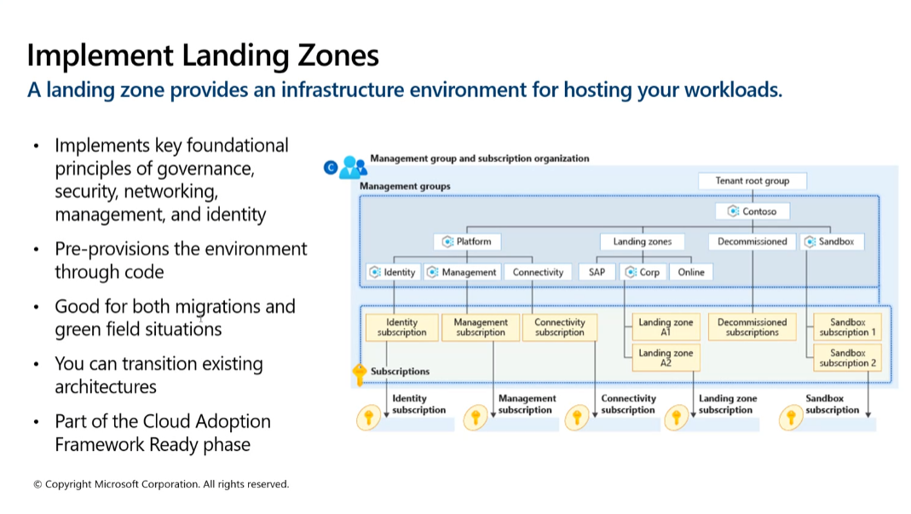

cloud adoption framework well our framework

## M2 - VM

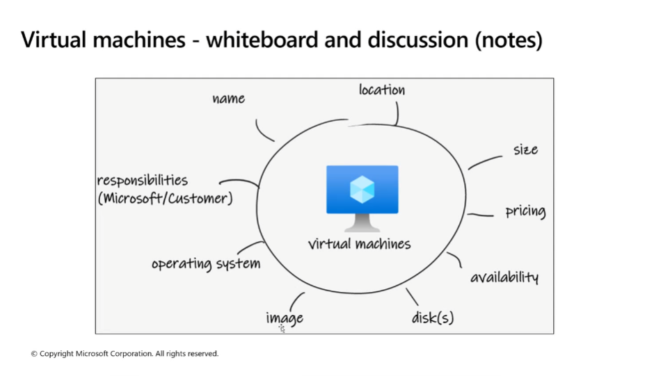

premium for db hosts

standard for web servers

check the IOPS

## Batch account

control scaling of machines

try to finish task as soon as possible

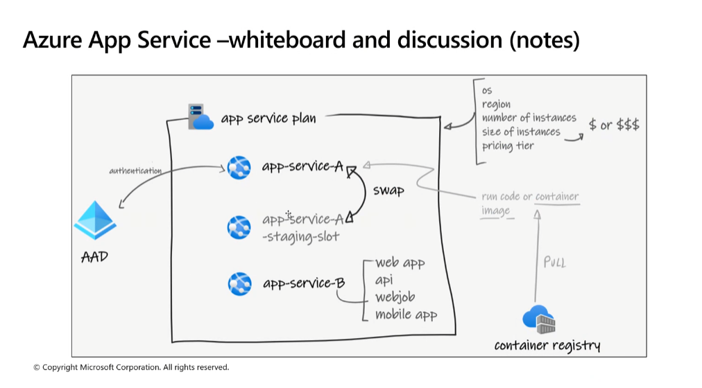

# M3 Storage

well architectured framework

Storage account controls all kinds of storage.

blob, file, disk

reliability

there is a check list

https://learn.microsoft.com/en-us/azure/well-architected/service-guides/storage-accounts/reliability

17000 requests concurrent on storage account is able to handle (standard)

LRS = 3 copies, 1 primary 2 secondary (auto replication) (same data center)

GRS = 3 Cpies in local, (1P2S), another location 3S

ZRS = 1P2S in different zone

GZRS = 6 copies

Same Microsoft Entra tenant mean under same subscription

hierarchical namespace is for ACL hadoop stuff

access key problem - it is a very sensitive data, it is a master key

we can use SAS which is more granular and can generate url

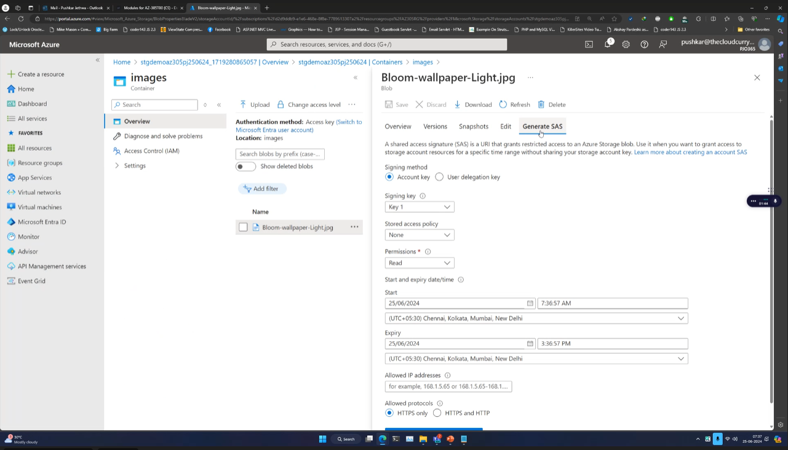

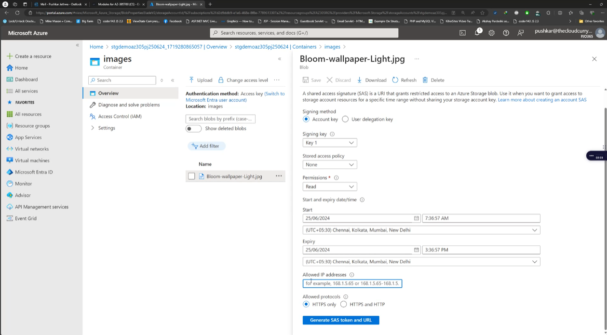

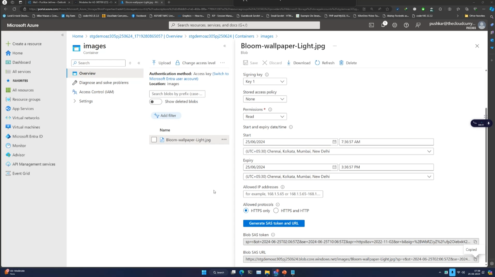

file share can be mounted to machines

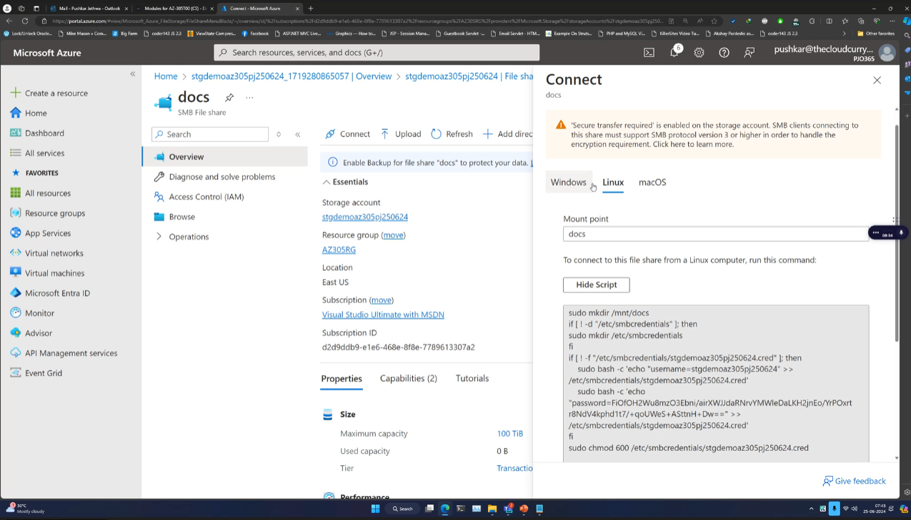

## M4- structured database

avaialbility and backup

- VM
- managed database instance/server
- managed database (single database model, )

VM has database instance has database

we need to overallocate VM for the database. because we dont have specific way to allocate it.

different hardware requirement for different database -> use azure database service (single database)

specify the resources when creating the database

demo:

1. create sql database server
1. workload en

PITR shortterm, LTR long term. 7 day is default.

prod suggest geo redundant

CPU

DTU - db transaction unit

collective metrics/ combined metrics

= vCPU, RAM, IOPS

need to do experiment to verify what actually DTU means to your service

there exists a tool visualize how db perform and suggest what dtu needed

DTU hard to calculate -> use elastic pool

shared pool of resources

run one month to observe resource utilization

migration in/out elastics pool takes few minutes, but transactions wont lose

starvation might not use up all resources as it will free up some, and it will fire warning

DTU limits the data max size

dont use serverless

hyperscal high availabililty

top is business critical

sql database limits

IO read write latency

max IOPS

log rate and speed

configure network setting to allow connection to the created databse server

firewall rule on server level, not database level

login with the same db credentials -> dont know who make the change

can provide extra entra identitiy user to accesss the db

service principal account ok for developer not ok for admin

dynamic data masking, column encryptions

go to each table in ms sql, select column

admin can see plain text, user see masked

no database performance impact

if use encrypt, there is

