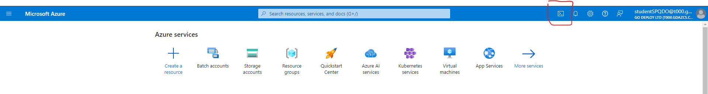
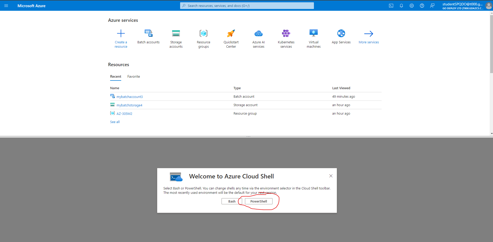
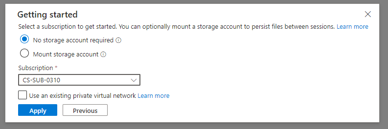
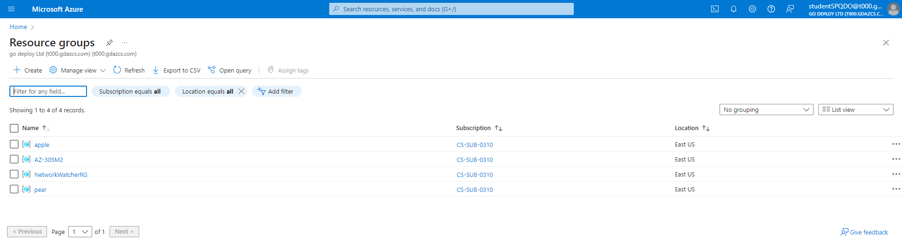
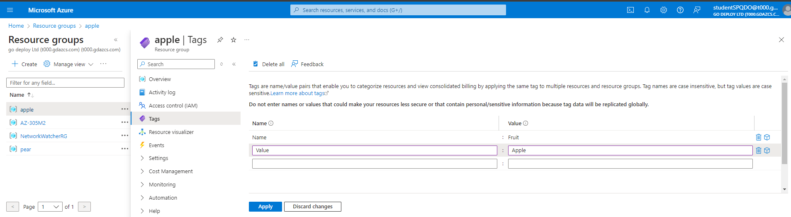
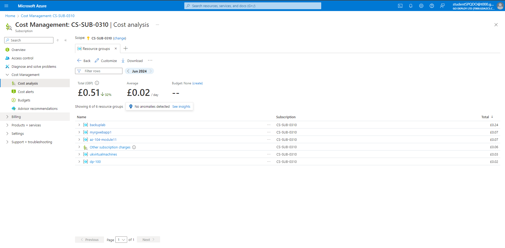
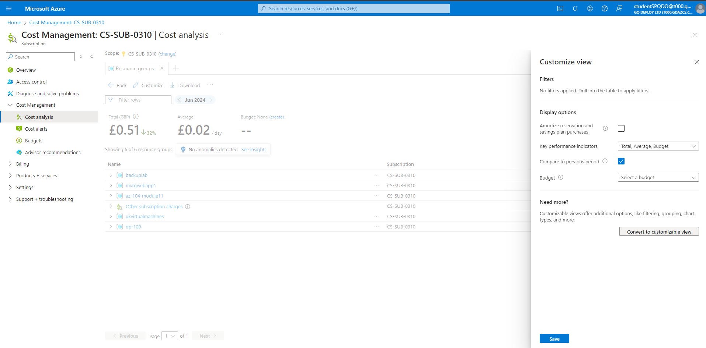

# Module 01: Tagging resources and implementing policy restrictions

In this lab, students will navigate the Azure portal, learning to create and manage resources such as virtual machines, storage accounts, and network components. They will set up a virtual machine, explore the Azure dashboard, and grasp cloud computing fundamentals within Azure, aiming to get comfortable with Azure's environment and basic resource management.

## Task 1: Creating and tagging resources

In this task, you will create some resource that will then be used to demonstrate cost management.

1. On the **Welcome to Microsoft Azure** dialogue box click **Maybe Later**.  If an Azure recommendations dialog box pops up click **X**.

1. Select **Cloud Shell** from the Azure Portal tool bar
    

1. Select **PowerShell** on the Welcome screen.
    

1. Select subscription and apply
    

1. From the PowerShell Cloud Shell pane, run the following to create 2 resource groups called **apple** and **pear** (make sure to hit return after the last command to execute it):

    ```powershell
    # Create a resource group named 'apple'
    New-AzResourceGroup -Name "apple" -Location "EastUS"
    ```

    ```powershell
    # Create a resource group named 'pear'
    New-AzResourceGroup -Name "pear" -Location "EastUS"
    ```

1. Now we will create some resources in these 2 resource groups

    ```powershell
    $VerbosePreference = 'Continue'
    ```

1. Create virtual networks in the 'apple' resource group

    ```powershell
    $appleResourceGroupName = "apple"
    $appleLocation = "EastUS"
    $vnetNames = @("vnet1", "vnet2", "vnet3")
    foreach ($vnetName in $vnetNames) {
        # Define the subnet configuration for the virtual networks
        $subnetConfig = New-AzVirtualNetworkSubnetConfig -Name "default" -AddressPrefix "10.0.0.0/24"
        # Create the virtual networks
        New-AzVirtualNetwork -Name $vnetName -ResourceGroupName $appleResourceGroupName -Location $appleLocation -AddressPrefix "10.0.0.0/16" -Subnet $subnetConfig
    }
    ```

1. Create disks in the 'pear' resource group

    ```powershell
    $pearResourceGroupName = "pear"
    $pearLocation = "EastUS"
    $diskNames = @("Disk1", "Disk2", "Disk3")
    foreach ($diskName in $diskNames) {
        # Create disk configuration
        $diskConfig = New-AzDiskConfig -Location $pearLocation -CreateOption Empty -DiskSizeGB 128
        # Create the disks
        New-AzDisk -DiskName $diskName -Disk $diskConfig -ResourceGroupName $pearResourceGroupName
    }
    ```

1. Minimize Cloud Shell as you will need it again at a later stage.

1. In the Azure portal, Navigate to **Resource groups** and open the resource group **apple**

1. On the **Resource group** blade, click **Tags**.
1. Enter the following values and click **Apply**.
   | Setting | Value |
   | ------- | ----- |
   | Name    | Fruit |
   | Value   | Apple |

    
1. In the Azure portal, Navigate to **Resource groups** and open the resource group **pear**.

1. On the **Resource group** blade, click **Tags**.

1. Enter the following and click **Apply**
   | Setting | Value |
   | ------- | ----- |
   | Name    | Fruit |
   | Value   | Pear  |

1. On the **Resource group** blade, click **Overview** then click on **Disk1**.

1. On the **Disk** blade, click on **Tags**.

1. Notice that **Disk1** does not have a tag as tags do not inherit from the resource group automatically.

1. Select **Cloud Shell** from the Azure Portal tool bar.

1. We will now assign tags to the disks and the vnets using the following Powershell script in the cloud shell:

1. Enable verbose output

    ```powershell
    $VerbosePreference = 'Continue'
    ```

1. Resource groups to process

    ```powershell
    $resourceGroups = @("apple", "pear")
    ```

1. Tag to be applied

    ```powershell
    $tag = @{project="az305labwork"}
    ```

1. Loop through each resource group

    ```powershell
    foreach ($resourceGroup in $resourceGroups) {
        Write-Verbose "Processing Resource Group: $resourceGroup"

        # Get all resources in the resource group
        $resources = Get-AzResource -ResourceGroupName $resourceGroup
        Write-Verbose "Found $($resources.Count) resources in $resourceGroup"

        # Loop through each resource and apply the tag
        foreach ($resource in $resources) {
            Write-Verbose "Applying tag to Resource: $($resource.ResourceName)"

            # Merge existing tags with the new tag
            $currentTags = $resource.Tags
            if ($currentTags -eq $null) { $currentTags = @{} }
            $newTags = $currentTags + $tag

            # Apply the tags to the resource
            Set-AzResource -ResourceId $resource.ResourceId -Tag $newTags -Force -Verbose
        }
    }
    ```

1. Minimize Cloud Shell as you will need it again at a later stage.
1. Return to the Resource group **pear** and select **Disk1**, click **Tags** and notice the newly assigned tag.
1. We now have a number of resources that have been tagged on both the Resource group level and the resource level, we can use these tags to more effectively perform cost management.

## Task 2: Viewing resources and filtering for tags in cost management

1. In the Azure portal, search for and select **`Cost management + billing`**, you can find this on the navigation bar on the left or by searching in the search bar at the top

1. Inside **Cost Management + Billing** select **Cost Management**.

1. Under **Cost Management**, select **Cost Analysis**.
1. Click **Resource Groups**
1. Here you can see your costs of your Azure resources by Resource group.

    
    

1. Click the **Customize** button in this Resource Group list tab.
1. Click **Convert to customizable view** button.
1. Click **Convert to customizable view** button.
1. Click **Group by: Resource group name** on the top right of the list of resources.
1. Scroll down in the list of **Group By** and select **Tag**.
1. Here you can select the tags created earlier of **fruit:apple** **fruit:pear** and **project:az305labwork** if you have worked through to this point quickly you may not yet see these tags appear as they can take some time (up to 24 hours) to appear in cost management after being initially assigned to resources. This will not effect the next part of the lab.
1. Take note of the **Save**, **Save As** and **Share** buttons for this custom view allowing co-authoring and collaboration of cost manangement views accross Azure administrators.

## Task 3: Creating Policy's to restrict Virtual machine locations

1. In the Azure portal navigate to **`Resource Groups`** and click **+ Create**.
1. Create a Resource Group called **`UKVirtualMachines`** and set the Region to **UK South** then click **Review and Create** and then **Create**
1. We have created a **Resource group** that is in **(Europe) UK South** but is not restricted to resources in UK South. To prove this point we will now deploy a simple virtual machine to this resource group that is hosted in **East US**.
1. In the Azure portal, search for and select **`Virtual Machines`**.
1. Click **+ Create** then select **Azure virtual machine**.
1. Set the following settings:

    | Setting              | Value                                |
    | -------------------- | ------------------------------------ |
    | Resource Group       | UKVirtualMachines                    |
    | Virtual Machine Name | AmericaVM                            |
    | Region               | (US) East US                         |
    | Availablity options  | No infrastructure redudancy required |
    | Authentication type  | Password                             |
    | Username             | AmericanAdmin                        |
    | Password             | DfrQawguF4aGqFjA                     |

1. Click **Review + Create**.
1. Then click **Create** and wait for the machine to deploy.
1. We can see that the **AmericaVM** can deploy to the resource group for the UK machines, we are now going to restrict this action with a policy.
1. Search for **`Policy`** in the search bar and Select **Policy**
1. Under **Authoring**, click **Definitions**.
1. In the **Filter by name or ID...** under **Search**, search for **`Allowed Locations`**.
1. Select the **Allowed locations** Policy.
1. Click **Assign**.
1. In the **Basics** tab, under **Scope**, click the **...(ellipsis)**.
1. Select the subscription **CS-SUB-0164** and Resource group **UKVirtualMachines** then click **Select**.
1. Scroll down and notice **Policy Enforcement** is set to **Enabled**, this means the Policy will take effect immediately and also effect resources that are not compliant with the policy (like the AmericaVM we just deployed, lets see what happens to it later).
1. Click **Parameters** and in the drop down list under **Allowed locations**, select **UK South**.
1. Click **Review + Create** then click **Create**
1. Return to the main Policy windows and select **compliance**
1. Here you can see your policy applied to the resource group, this could take a few minutes to take effect and you may need to refresh the portal
1. Return to the **UKVirtualMachines** resource group
1. Notice the **AmericaVM** Virtual machine is still there even though it is not compliant, Azure will not delete a non-compliant resource unless you explicitly make a remediation for that action.
Search for and select **`virtual machines`** in the search bar, click **+ Create -&gt; Azure virtual machine**
1. Use the following settings to create a virtual machine:

    | Setting              | Value                                |
    | -------------------- | ------------------------------------ |
    | Resource Group       | UKVirtualMachines                    |
    | Virtual Machine Name | AmericaVMWest                        |
    | Region               | West US                              |
    | Availablity options  | No infrastructure redudancy required |
    | Authentication type  | Password                             |
    | Username             | AmericanAdmin                        |
    | Password             | DfrQawguF4aGqFjA                     |

1. Click **Review + create** and you will be presented with an error of **Validation Failed**, click on it.
1. In the Summary you can see **disallowed by policy**.
1. click **Raw Error** to see the full error, in the message section of this large JSON you can see the exact policy that has denied this deployment.
1. You can now use the following script in the Azure Cloud Shell to clean up the resources used in this lab by force deleting the resource groups and the contents of them. You may wish to backtrack to take another look at cost management at this point to see if you can now filter by tag, you may also want to to experiment with deploying other resources in different regions to your restricted resource group. Or, you may wish to have a look at some other other default policies on offer, inlcuding those for restricting the SKU (or size) of virtual mahcines that can be deployed. Remember, policies can be deployed at the resource group level, the subscription level and even at the mangement group level.

1. Enable verbose output

    ```powershell
    $VerbosePreference = 'Continue'
    ```

1. Resource groups to delete

    ```powershell
    $resourceGroups = @("apple", "pear", "UKVirtualMachines")
    ```

1. Loop through each resource group and delete

    ```powershell
    foreach ($resourceGroup in $resourceGroups) {
        # Force delete the resource group and all its contents
        Remove-AzResourceGroup -Name $resourceGroup -Force -AsJob
    }
    ```
