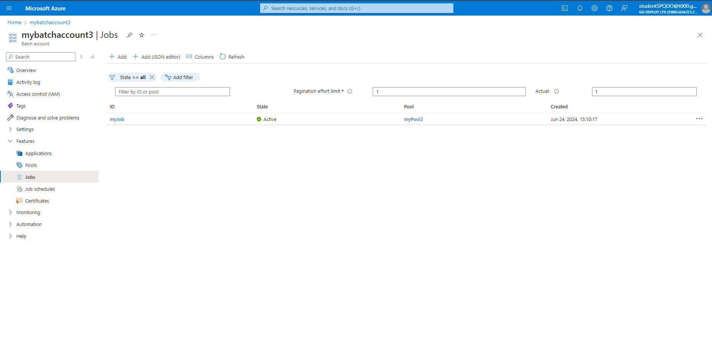
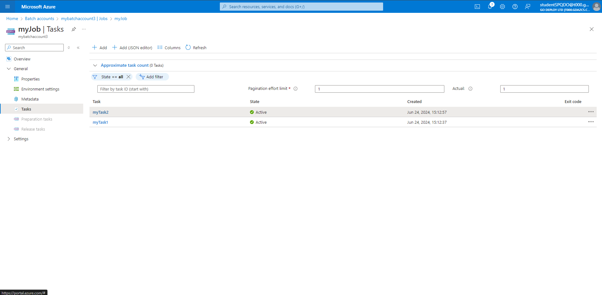
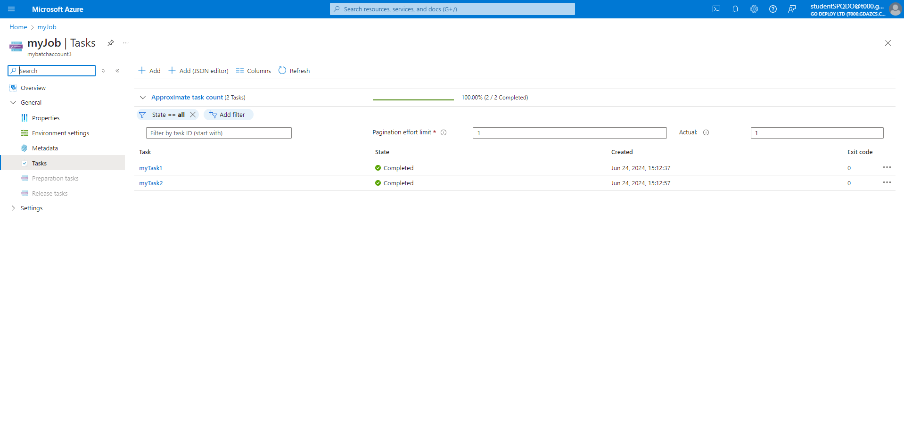
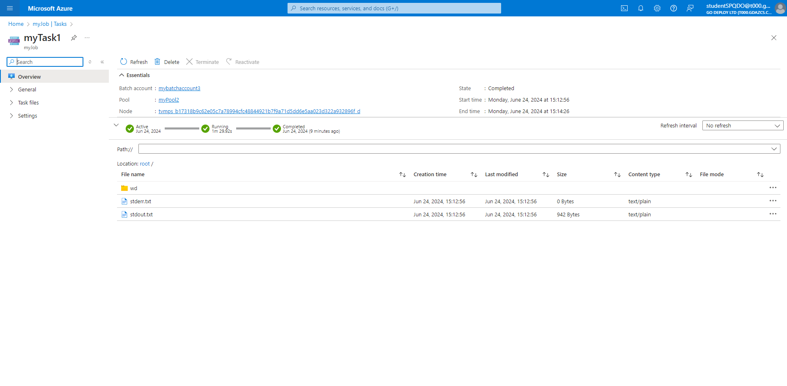
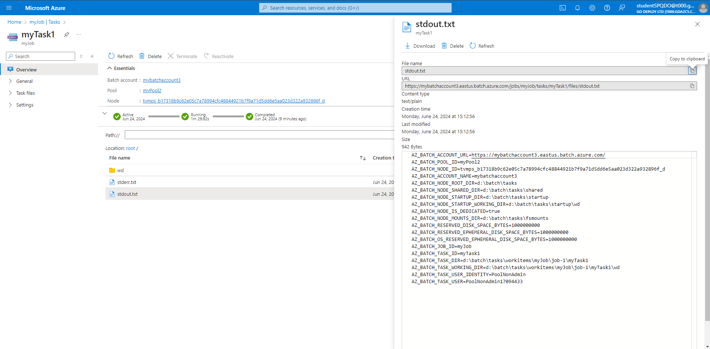

# Module 02: Deploying Azure Batch, Container Apps, Kubernetes, Azure Dev Template app

## Exercise 1: Azure Batch

### Task 1: Azure Batch


1. Using the search bar, search for and select batch accounts.


1. On the Batch accounts page, select + Create.

1. On the New Batch account page, enter or select the following values:

  1. Under Resource group, select AZ-305M2 and then select OK. The resource group is a logical container that holds the Azure resources for this quickstart.

  1. For Account name, enter the name mybatchaccount. The Batch account name must be unique within the Azure region you select, can contain only lowercase letters and numbers, and must be between 3-24 characters.

  1. For Location, select East US.

  1. Under Storage account, select the link to Select a storage account.

1. On the Create storage account page, click + Create new and under Name, enter mybatchstorage, (Note: Storage Account names must be lowercase). Leave the other settings at their defaults, and select OK.

1. Select Review + create at the bottom of the New Batch account page, and when validation passes, select Create.

1. When the Deployment succeeded message appears, select Go to resource to go to the Batch account that you created.

### Task 2: Create a pool of compute nodes

1. On your Batch account page, select Pools under Features from the left navigation.

1. On the Pools page, select + Add.

1. On the Add pool page, for Pool ID, enter myPool.

1. Under Operating System, select the following settings:

1. Publisher: Select microsoftwindowsserver.

1. Sku: Select 2019-datacenter-core-smalldisk.

1. Scroll down to OS disk storage account type and select Standard LRS.

1. Scroll down to Node size, and for VM size, select Standard_A1_V2.

1. Under Scale, for Target dedicated nodes, enter 2.

1. Accept the defaults for the remaining settings, and select OK at the bottom of the page.

    Batch creates the pool immediately, but takes a few minutes to allocate and start the compute nodes. On the Pools page, you can select myPool to go to the myPool page and see the pool status of Resizing under Essentials > Allocation state. You can proceed to create a job and tasks while the pool state is still Resizing or Starting.

    After a few minutes, the Allocation state changes to Steady, and the nodes start. To check the state of the nodes, select Nodes in the myPool page left navigation. When a node's state is Idle, it's ready to run tasks.

### Task 3: Create a job

1. On the mybatchaccount page, select Jobs under Features from the left navigation.

1. On the Jobs page, select + Add.

1. On the Add job page, for Job ID, enter myJob.

1. Select Select pool, and on the Select pool page, select myPool, and then select Select.

1. On the Add job page, select OK. Batch creates the job and lists it on the Jobs page.

### Task 4: Create tasks



1. On the Jobs page, select myJob.

1. On the Tasks page, select + Add.

1. On the Add task page, for Task ID, enter myTask1.

1. In Command line, enter:

    ```powershell
    cmd /c "set AZ_BATCH & timeout /t 90 > NUL".
    ```

1. Accept the defaults for the remaining settings, and select Submit.

1. Repeat the preceding steps to create a second task, but enter myTask2 for Task ID.

After you create each task, Batch queues it to run on the pool. Once a node is available, the task runs on the node. In the quickstart example, if the first task is still running on one node, Batch starts the second task on the other node in the pool.



### Task 5: View task output

1. The tasks should complete in a couple of minutes. To update task status, select Refresh at the top of the Tasks page.

1. To view the output of a completed task, you can select the task from the Tasks page. On the myTask1 page, select the stdout.txt file to view the standard output of the task.

1. The contents of the stdout.txt file are similar to the following example:

1. The standard output for this task shows the Azure Batch environment variables that are set on the node. As long as this node exists, you can refer to these environment variables in Batch job task command lines, and in the apps and scripts the command lines run.







Initial runs of the batch task may take some time as resources are allocated. You may continue with other labs and return to see the output later if you wish.
