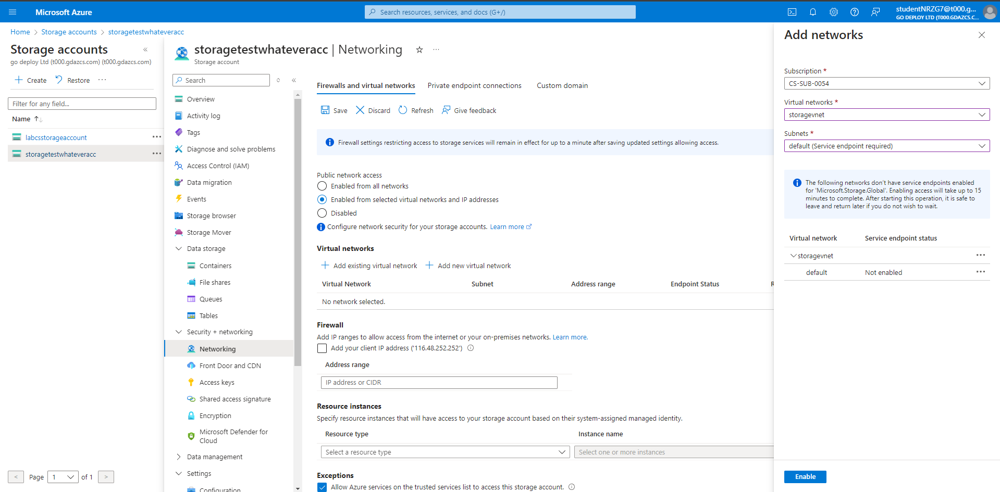

# lab-3
## Task 1: Create a resource group
1. Select Cloud Shell from the Azure Portal tool bar.
1. Select PowerShell on the Welcome screen.
1. In the You have no storage mounted pane, click Show advanced settings, perform the following tasks:
   1. Leave the Subscription drop-down list entry set to its default value of CS-SUB-0054.
   1. In the Cloud Shell region drop-down list, select the Azure region matching or near the location where you intend to deploy resources in this exercise.
   1. In the Resource group section, create a new resource group.
   1. In the Storage account section, ensure that the Create new option is selected and then, in the text box below, type a unique name consisting of a combination of between 3 and 24 characters and digits (Note: Storage Account names must be lowercase).
   1. In the File share section, ensure that the Create new option is selected and then, in the text box below, type cloudshell.
   1. Click the Create storage button.
1. Wait for the Cloud Shell to finish its first-time setup procedures before you proceed to the next step.
1. From the PowerShell Cloud Shell pane, run the following to create a resource group called storagetest.
1. Create a resource group named storagetest
   ```powershell
   New-AzResourceGroup -Name "storagetest" -Location "EastUS"
   ```
## Task 2: Create a vnet with a bastion host for remote connection
1. In the Azure Portal search for and select Virtual Networks
1. Click + Create
1. Select subscription CS-SUB-0054 and resource group storagetest
1. Use a virtual network name of storagevnet
1. Click Next and under the security options select the check box for Enable Azure Bastion
1. Click Review and create then Create
1. 
Bastion will take a few minutes to deploy but we can procced with other steps while it does.

## Task 3: Create a VM to connect from

1. In the Azure Portal Search for and select Virtual machines.
1. Click + Create.
1. Click Azure Virtual Machine.
1. Select subscription CS-SUB-0054 and resource group storagetest
1. Use storagevm as the name for the Virtual machine.
1. Select (US) East US for the Region.
1. Select No infrastructure redundancy required for Availability options
1. Change the Image to Windows Server 2022 Datacenter: Azure Edition Hotpatch - X64 Gen2.
1. Under Administrator account enter Username storageadmin and Password 9BT3W3XKWQlNbQLK.
1. Tick the box for existing windows license.
1. Select Networking at the top and make sure that storagevnet virtual network is being used.
1. Click Monitoring and disable boot diagnostics.
1. Click Review + Create then Create.

## Task 4: Create a storage account and add some information

1. Search for storage accounts and select Storage accounts.
1. Click + Create.
1. Use the same resource group of storagetest
1. For the account name use storagetest+somethingunique as the name needs to be unique in all of Azure, e.g. storagetestbanjo33.
1. Change the redundency to LRS
1. Click Review then Create.
1. Select Go to resource when it has finished deploying.

## Task 5: Add some information to the storage account

1. We will first demonstrate access to a blob store over a public network without any authentication.
1. Visit images.bing.com and find an image of a banana (or any image will do) save this to your desktop as banana.png (gif, jpg, png will do we simply need an image to host)
1. On your storage account click Configuration under Settings.
1. Change Allow Blob anonymous access from Disabled to Enabled and click Save.
1. On the storage account blade, click Containers under Data storage.
1. Click + Container.
1. Name the container fruit and set the access level to Container (anonymous read access for containers and blobs) then click Create.
1. This container is now wide open to the internet and we will demonstrate this now.
1. Open the fruit container, click Upload and upload the image file you downloaded earlier.
1. Click onto your newly uploaded file.
1. Copy the URL of the file and put it into a new browser tab.
1. You should see your image displayed (keep this URL to hand in notepad you will need it later).



## Task 6: Restricting access to the image file to only our private network


Navigate to Virtual networks and select the storagevnet virtual network you created earlier.

Select Service endpoints under Settings then click +Add.

Search for and select microsoft.storage in the service dropdown .

Select the default subnet in the other drop down menu and click Add.

Return to your storage acccount

Click Networking under Security + Networking.

Click Private endpoint connections

Click +Private endpoint.

Use the same resource group of storagetest

Enter the name storageprivateendpoint

Click Next : Resource>.

Under Resource set the target sub-resource to blob.

Click Next : Virtual Network>

On Virtual Network select storagevnet and the default Subnet.

Click Next : DNS > and accept the settings by clicking Next : Tags > and then Next : Review + Create and Create

You have now created a private endpoint from the blob storage (container, Microsoft changed names in the portal) to your vnet we created earlier

Wait for this to deploy and to show under the private endpoint connections page, this will take a couple of minues to deploy fully, you can see the progress by clicking the bell icon

## Task 7: Testing the private endpoint connection


When the deployment is complete you can visit the newly created private endpoint in the resource group where you created your storage account

In the private endpoint click DNS configuration under Settings.

Review that the vNIC and FQDN both have a private IP from the network they are connected too.

Return to the storagevm virtual machine you created earlier, click on Connect and connect via bastion.

Log in with the Username storageadmin and Password 9BT3W3XKWQlNbQLK, you used earlier when creating the virtual machine.

Open edge in the bastion session and visit the URL of your image from earlier and notice you can view your image

Open the Start Menu and

Type nslookup yourstorageaccount.blob.core.windows.net and notice the IP address output is the same as that of the private endpoint

This shows that traffice for your image is flowing over the private endpoint and not the public endpoint

## Task 8: Secure the link


Leave the bastion session open, you will need it to confirm the next test.

Return to your storage account

Click Networking under Security + Networking.

Change the Public Network Access to Enabled from selected virtual networks and IP addresses.

Click + Add existing virtual network.

Select your storagevnet and the default subnet then click Add.

Click Save on the networking settings to commit the change.

Check access to your image from the brower on your machine, you should see an error of AuthorizationFailure

Return to the bastion machine connection .

Refresh the link to your image and confirm access is still available from the private network over the private link that was created erlier

You have now set up an azure storage account with a private link to a vnet so that only the machines and services in that vnet can access resources inside the storage account.

## Task 9: Adding additional disks to exisiting Virtual Machines


In the Azure Portal, Search for and select disks

Click + Create.

Use the same resource group as before storagetest.

Give the Disk Name a name of addme

Change the Availability zone to No infrastructure redudancy required.

Select Change size and change the disk size to 8 Gib (Standard SSD), then click OK.

Click Review + create then Create.

Return to your Virtual Machine in the Azure portal.

Click Disks under Settings.

Click Attach existing disks.

Under Disk Name, select your addme disk then click Apply.

Return to the Virtual Machine bastion session.

Open file explorer and note there is no extra disk (the D: Temporary Storage disk is there as part of the inital creation)

In the windows server search type Disk Management

Select Create and Format hard disk pertitions

You will be prompted for disk2 to be initialised OK it to initilise the disk

In the MMC console note Disk 2 is unformatted

Right click on the unallocated space and click New Simple Volume...

Click Next > through the New Simple Volume Wizard then click Finish and it will format the whole disk as NTFS with a label of F:.

This disk is now useable with this virtual machine.


