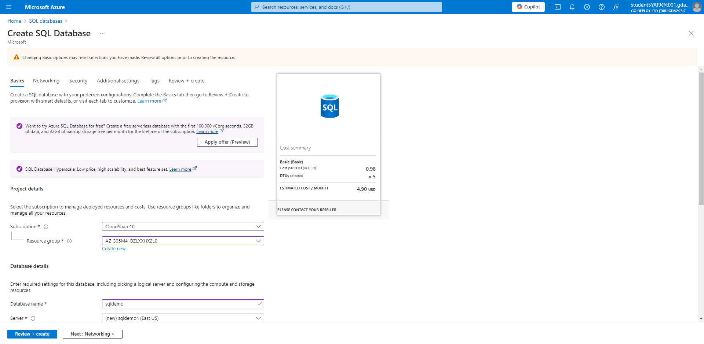
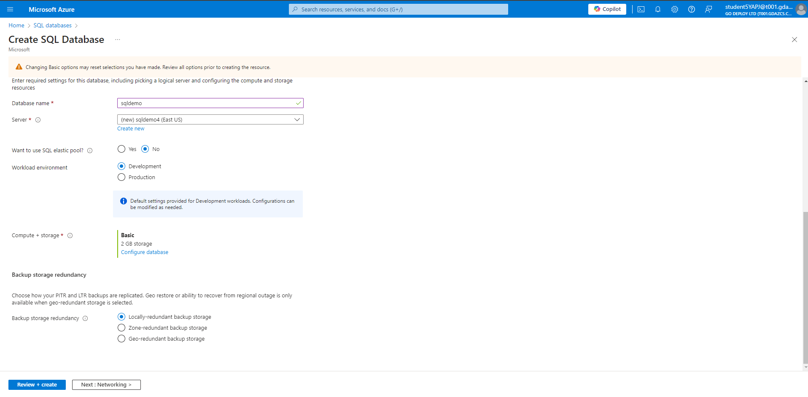
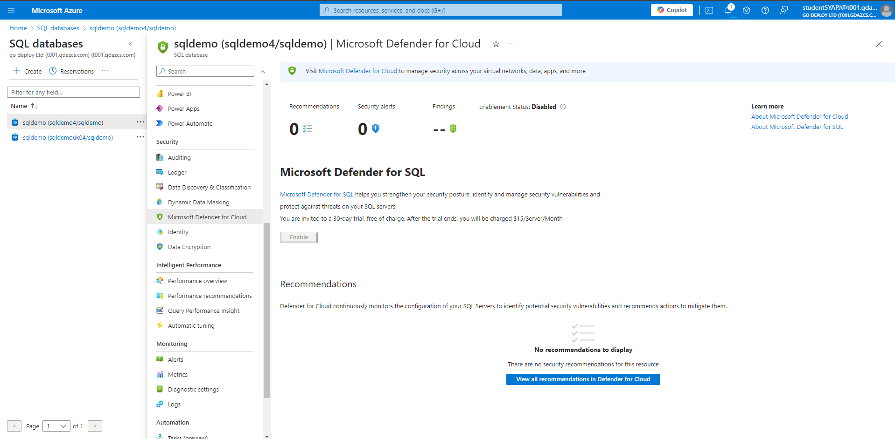
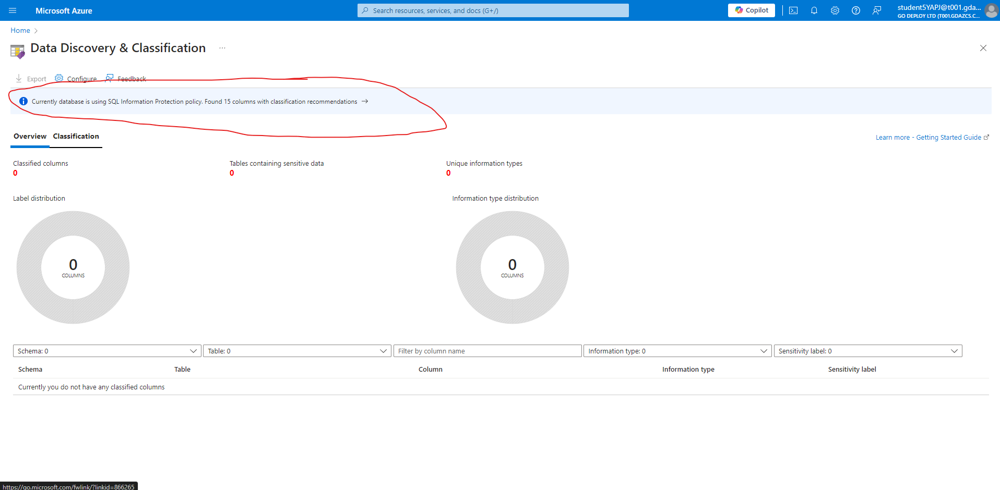
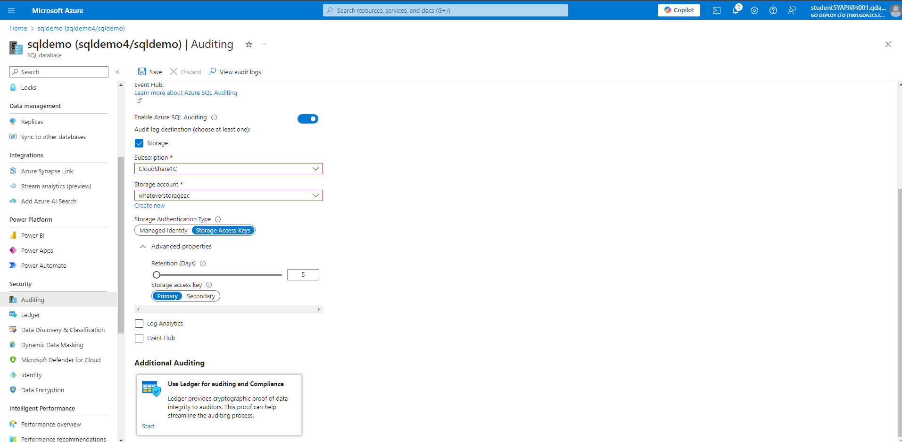

# Module 04: Deploying SQL server with secure network access

Within this lab we will create an Azure SQL server with some test data inside it. We will then create Private links to this database and enable replicas. We will also enable Dynamaic Data masking on the test data inside the replicated database.

## Exercise 1: SQL Database and Server

### Task 1: Creating a SQL Database and Server

1. If necessary, log into CLIENT1 with the username Admin and password Pa55w.rd

1. Open a browser and navigate to the following URL: https://portal.azure.com.

1. Log into the Azure Portal with the username student5YAPJ@t001.gdazcs.com and password sv5baAVlncNvPaI8.

1. In the search bar, search for and select sql databases

1. Click + Create.

1. Fill in the follwing values

| Name | Value |
| ---- | ----- |
| Resource Group | AZ-305M4-OZLXXHX2L0 |
| Database name | sqldemo+uniquestring (e.g sqldemo1997) |

1. Click Create new next to Server.

1. The server name needs to a unquie string (e.g. sqldemo4321)

1. Location: (US) East US

1. Authentication method select Use SQL Authentication

| Name | Value |
| Server admin login | sqldemoadmin |
| Password | sv5baAVlncNvPaI8 |

1. Click OK to return to the SQL database screen.

1. On the Compute + storage option click Configure Database.

1. Change the Service tier to DTU Basic.

1. Click Apply.

1. Change Backup Storage Redundancy to Locally-redundent backup storage.

1. Click Next : Networking > to advance to the Networking tab.

1. Set Connectivity method to Public endpoint.

1. On Add current IP address, select Yes.

1. Click Next : Security > to advance to Security tab.

1. Click Next : Additional settings > to advance to the Additional settings tab.

1. On Use existing data select Sample then click OK.

1. This will automatically populate the database with some sample data to work with in the lab.

1. Click Review + create then click Create.

1. Wait for the new sql database to deploy.

1. Once the resource is deployed click Go to resource.

### Task 2: Check there is sample data

1. Click Query Editor

1. Login with the username sqldemoadmin and the password sv5baAVlncNvPaI8.

1. Expand tables to see that there is sample data imported

1. Run the following SQL command in the Query pane to see some of the data.

`SELECT * FROM [SalesLT].[Customer]`

1. If there is no sample data you have probably missed a step above, you can proceed if you wish but be aware any SQL querys you run will return no data

## Exercise 2: Private endpoint link to the sql server
### Task 1: Create a vnet with a bastion host for remote connection

1. In the Azure portal search for and select Virtual Networks.

1. Click + Create.

1. Use Resource group AZ-305M4-OZLXXHX2L0.

1. Use a virtual network name of sqlvnet.

1. Click Next to the Security tab. Under Azure Bastion, select the tick box for Enable Azure Bastion

1. Click Review and create then Create.

1. Bastion will take a few minutes to deploy but we can procced with other steps while it does.

### Task 2: Create a VM to connect from

1. In the Azure portal, search for and select Virtual machines.

1. Click +Create then Azure virtual machine

1. Use the same resource group, AZ-305M4-OZLXXHX2L0.

1. Use sqlvm as the name for the Virtual machine.

1. Select (US) East US for the Region.

1. Select No infrastructure redundancy required for Availability options

1. Change the Image to Windows Server 2022 Datacenter: Azure Edition Hotpatch - X64 Gen2.

1. Under Administrator account enter Username sqladmin and Password sv5baAVlncNvPaI8.

1. Tick the box for existing Windows Server licence.

1. Select the Networking tab at the top and make sure that sqlvnet is being used.

1. Click the Monitoring tab and Disable boot diagnostics.

1. Click Review + Create then Create.

### Task 3: Enable a Service Endpoint

1. Return to the Virtual network you created earlier (sqlvnet).

1. Under Settings, click Service Endpoints.

1. Click + Add

1. Search for and select Microsoft.SQL in the drop down menu.

1. Select Default for the subnet then click Add.

### Task 4: Check Connection from the VM

1. In the search bar, search for and select AZ-305M4-OZLXXHX2L0

1. Select the SQL Virtual machine (sqlvm).

1. Click Connect, Connect Via Bastion (your bastion may still be deploying if the state is Updating, wait a couple of minutes and refresh)

1. Enter Username sqladmin and Password sv5baAVlncNvPaI8 then click Connect.

1. Open command prompt inside this bastion connecion to sqlvm.

1. Run the following command (replace yourservername with your server name)

1. `nslookup yourservername.database.windows.net`

1. Note the result obtained is a public IP as there is no private endpoint.

1. Leave this connection open an a new tab.

### Task 5: Enable a Private Endpoint

1. In the search bar, search for and select AZ-305M4-OZLXXHX2L0

1. Select your SQL server.

1. Click Networking under Security.

1. Click private access.

1. Click + Create private endpoint.

1. Name your endpoint sqlendpoint.

1. Network Interface Name sqlendpoint-nic.

1. Click Next : Resource > and review the settings.

1. Click Next : Virtual Network > and make sure the Virtual network is sqlvnet from earlier and the subnet is set to the default.

1. Click Next : DNS> and Next : Tags> to reach the end of the wizard.

1. Click Review + Create and click Create.

1. Wait for this private endpoint to deploy.

### Task 6: Test the Private Endpoint

1. Return to the bastion connect to sqlvm.

1. Return to the cmd prompt and rerun the command:

`nslookup yourservername.database.windows.net`
1. Take note that you are now being routed to the sql server by using the private endpoint and a private IP address

### Task 7: Make a replica to another region

1. Return to your SQL database

1. Under Data management, click Replicas.

1. Click + Create replica.

1. Underneath server click Create New.

1. Enter a new server name and pick a different location to before (e.g. sqldemoUK and UK south).

1. Use SQL authentication

| Name | Value |
| Server admin login | sqldemoadmin |
| Password | sv5baAVlncNvPaI8 |

1. Click OK.

1. Click Review + create.

1. Click Create and wait for the deployment to complete

## Exercise 3: Dynamic data masking

## Task 1: Configure Advanced Data Protection

1. In the Azure portal, in the Search resources, services, and docs text box at the top of the Azure portal page, type Resource groups and press the Enter key.

1. On the Resource groups blade, in the list of resource group, click the resource group AZ-305M4-OZLXXHX2L0.

1. On the resource group blade, click the entry representing the newly created SQL Server.

1. On the SQL server blade, in the Security section, click Microsoft Defender for Cloud, select Enable Microsoft Defender for SQL.

1. Note: Wait until notification indicates Azure Defender for SQL has been successfully enabled.

1. Note: If you do not see the option to Enable Microsoft Defender for SQL, then it means your subscription already has this enabled.

1. On the SQL server blade, in the Security section, on the Microsoft Defender for Cloud page, in the Microsoft Defender for SQL: Enabled at the subscription-level (Configure) parameter, click (configure).

1. Note: Refresh the browser if (configure) is not displaying.

1. On the Server Settings blade, review the information about pricing and the trial period, VULNERABILITY ASSESSMENT SETTINGS and ADVANCED THREAT PROTECTION SETTINGS.

1. Back to Microsoft Defender for Cloud blade, review Recommendations and Security alerts.

1. Note: It may take 10-15 minutes for recommendations to appear on the Microsoft Defender for Cloud blade. Rather than waiting, proceed to the next task but consider returning to this blade once you complete all the remaining tasks.

## Task 2: Configure Data Classification

1. Navigate to the newely created SQL Server and on the SQL server blade, in the Settings section, click SQL Databases.

1. In the list of databases, select the sqldemo entry.

1. On the SQL database blade, in the Security section, click Data Discovery & Classification.

1. On the Data Discovery & Classification blade, click the Classification tab.

1. Note: The classification engine scans your database for columns containing potentially sensitive data and provides a list of recommended column classifications.

1. Click the text message We have found 15 columns with classification recommendations displayed on blue bar at the top of the blade.

1. Review the listed columns and the recommended sensitivity label.

1. Enable the Select all checkbox and then click Accept Selected Recommendations.

1. Note: Alternatively, you could select only certain columns and dismiss others.

1. Note: You have the option to change the information type and sensitivity label

1. Once you have completed your review click Save.

1. Note: This will complete the classification and persistently label the database columns with the new classification metadata.

1. Back on the Data Discovery & Classification blade Overview tab, note that it has been updated to account for the latest classification information.

## Task 3 : Configure auditing

1. In this task, you will first configure server level auditing and then configure database level auditing.

1. In the Azure portal, navigate back to the SQL Server blade.

1. On the SQL Server blade, in the Security section, click Auditing.

1. Note: This is server level auditing. The default auditing settings include all the queries and stored procedures executed against the database, as well as successful and failed logins.

1. Set the Enable Azure SQL Auditing switch to ON to enable auditing.

1. Select the Storage checkbox and entry boxes for Subscription and Storage Account will display.

1. Choose your Subscription from the dropdown list.

1. Click Storage account and choose Create new.

1. On the Create storage account blade, in the Name box, type a globally unique name consisting of between 3 and 24 lower case letters and digits then click OK,

1. Note: You may need to refresh the browser before the storage account becomes available.

1. Back on the Auditing blade, under Advanced properties set Retention (days) to 5.

1. On the Auditing blade, click Save to save the auditing settings.

1. Note: If you receive an error message regarding invalid storage container path then the storage account may not have have been provisioned yet. Wait a few minutes, click Storage account, on the Choose storage account blade, select the newly created storage account and back on the Auditing blade, click Save.

1. On the server blade, in the Settings section, click SQL Databases.

1. In the list of databases, select the name of your database entry.

1. On the SQL database blade, in the Security section, click Auditing.

1. Note: This is database level auditing. Server-level auditing is already enabled.

1. Note: Audits can be written to an Azure storage account, to a Log Analytics workspace, or to the Event Hub. You can configure any combination of these options.

1. Note: If storage-based auditing is enabled on the server, it will always apply to the database, regardless of the database settings.

1. On your SQL database Overview page in the Azure portal, select Query editor (preview) from the left menu. Try to sign in, you might fail on password, firewall rule for your IP address, everything gets audited. Try successfull login as well, run query and you might find more detials in audit logs

1. Switch back to DB, Auditing and Click View Audit Logs.

1. On the Audit records blade, note that you can switch between Server audit and Database audit.

1. Results: You have created a SQL server and database, configured data classification and auditing.

