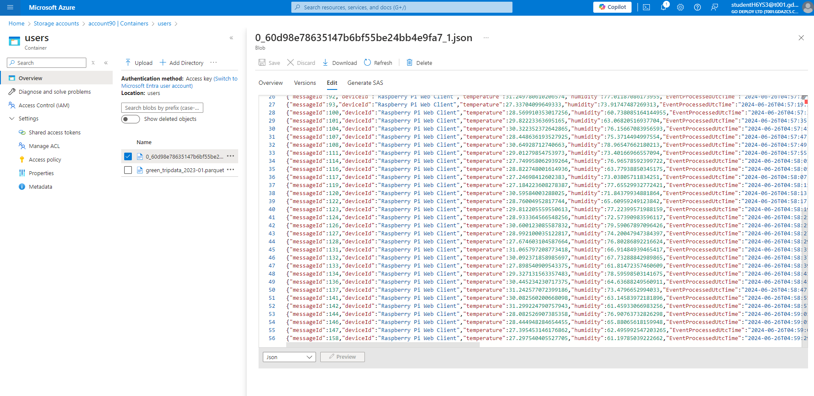
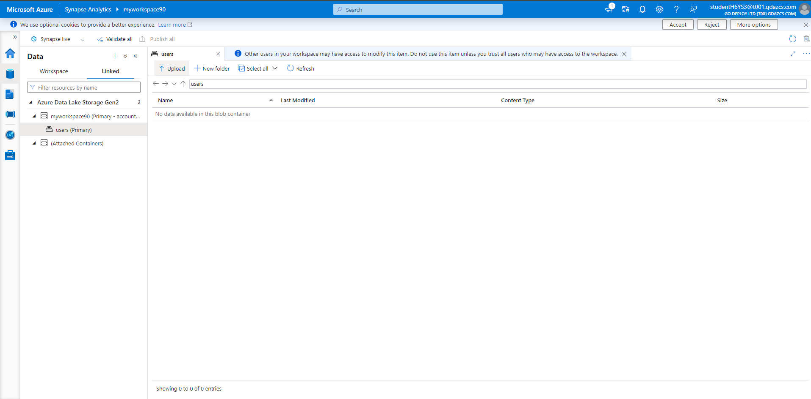
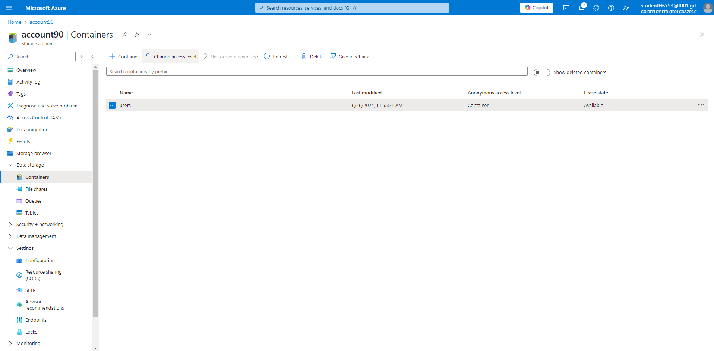
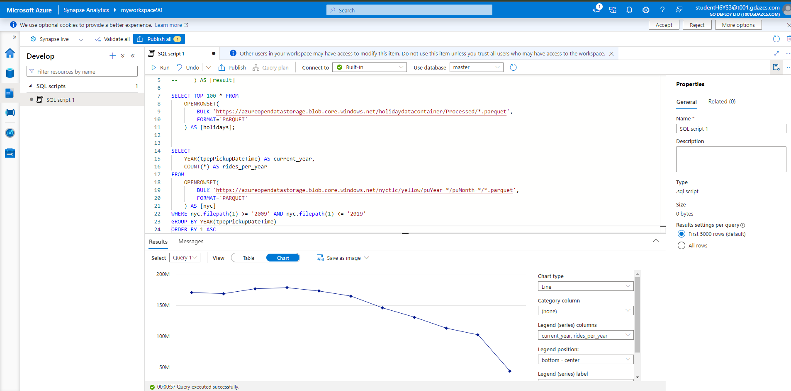
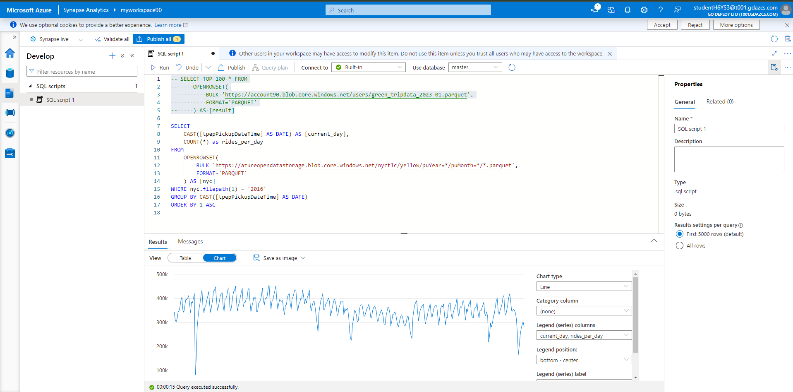
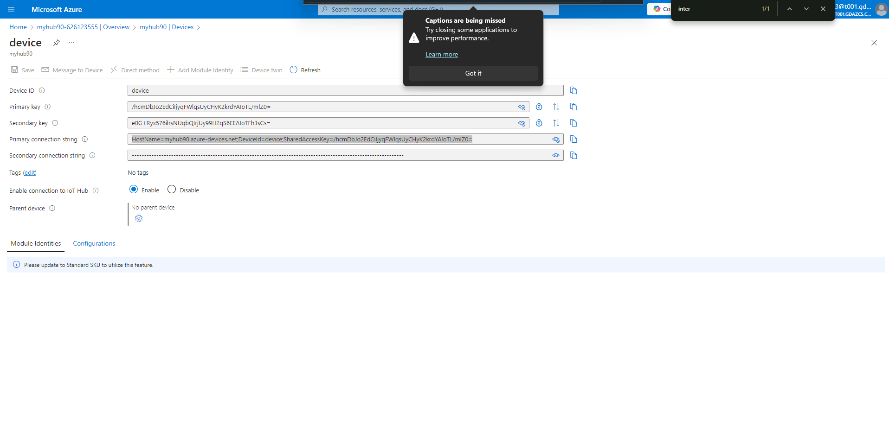

# Module 05: Working with Azure Synapse Studio for data analytics

Within this lab we will work with Azure synapse Studio to analise some data. We will import .parquet files of collected data from the NYC taxi database of taxi trips in the city. After creating Synapse Studio and falling back on the test data to complete the tasks we will also create an Azure Stream Analytics resource and use a simulated raspberry Pi to send events into it for proccessing.

## Exercise 1: Azure Synapse

### Task 1: Create a Synapse Workspace

Within this lab we will work with Azure synapse Studio to analise some data. We will import .parquet files of collected data from the NYC taxi database of taxi trips in the city. After creating Synapse Studio and falling back on the test data to complete the tasks we will also create an Azure Stream Analytics resource and use a simulated raspberry Pi to send events into it for proccessing.


If necessary, log into CLIENT1 with the username Admin and password Pa55w.rd

Open a browser and navigate to the following URL: https://portal.azure.com.

Log into the Azure Portal with the username studentH6YS3@t001.gdazcs.com and password 5U3V4UFpP09oE4eX.

Open the Azure portal, in the search bar enter Synapse without hitting enter.

In the search results, under Services, select Azure Synapse Analytics.

Select + Create to create a workspace.

Select the resource group AZ-305M5-T7Z1YT1AFI.

Workspace name - Pick any globally unique name. In this tutorial, we'll use myworkspace.

Region: East US.

Under Data Lake Storage Gen2, select Create new to and use a unique name then click OK

Select Create new and use a file system name of users then click OK.

Click Review + create then Create.

Wait for the deployment to complete.

### Task 2: Open Synapse Studio
In Edge/Chrome visit https://web.azuresynapse.net.

Select the workspace name you created previously and click Continue.

For our data we will use some collected data from the open NYC taxi data.

Visit https://www.nyc.gov/site/tlc/about/tlc-trip-record-data.page in your browser.

Pick the year 2023 and the month of January and then click Green Taxi Trip Records (PARQUET).

This will download a parquet file of NYC taxi data that we will ingest into synapse, save this file to the computer/VM you are currently working on.

In the Synapse Studio navigate to the Data (the database icon on the left).

Select Linked.

Expand Azure Data Lake Storage Gen2 and your workspace.

Select users (Primary) and click Upload.

Browse to and upload the green_tripdata parquet file.

Once uploaded, right-click the file and click Properties... to display both the URL and the ABFSS path of the uploaded file, copy both of these paths to a notepad file as we will need them for later.

### Task 3: Analyze data with a serverless SQL pool
In Synapse Studio, go to the Develop hub.

Create a new SQL script by clicking the + icon and then SQL script.

Paste the following code into the script.

```sql
SELECT TOP 100 * FROM
    OPENROWSET(
        BULK 'https://contosolake.dfs.core.windows.net/users/NYCTripSmall.parquet',
        FORMAT='PARQUET'
    ) AS [result]
```
Click Run and review the output

## Exercise 2: Explore and Analyze data lakes with serverless SQL pool

The data that is used in the SQL queries in this section is stored on a public Microsoft Datalake so you do not need to change the data source URL for the purpose of this demonstration of Synapse functionality. Each SQL query can be run in the same way as the previous instruction

### Task 1: Automatic schema inference

Since data is stored in the Parquet file format, automatic schema inference is available. You can query the data without listing the data types of all columns in the files. You also can use the virtual column mechanism and the filepath function to filter out a certain subset of files.


To get familiar with the NYC Taxi data, run the following query:

```sql
SELECT TOP 100 * FROM
    OPENROWSET(
        BULK 'https://azureopendatastorage.blob.core.windows.net/nyctlc/yellow/puYear=*/puMonth=*/*.parquet',
        FORMAT='PARQUET'
    ) AS [nyc]
```

Similarly, you can query the Public Holidays dataset by using the following query:

```sql
SELECT TOP 100 * FROM
    OPENROWSET(
        BULK 'https://azureopendatastorage.blob.core.windows.net/holidaydatacontainer/Processed/*.parquet',
        FORMAT='PARQUET'
    ) AS [holidays]
```

You can also query the Weather Data dataset by using the following query:

```sql
SELECT TOP 100 * FROM  
    OPENROWSET(
        BULK 'https://azureopendatastorage.blob.core.windows.net/isdweatherdatacontainer/ISDWeather/year=*/month=*/*.parquet',
        FORMAT='PARQUET'
    ) AS [weather]
```

You can learn more about the meaning of the individual columns in the descriptions of the data sets:

NYC Taxi https://azure.microsoft.com/services/open-datasets/catalog/nyc-taxi-limousine-commission-yellow-taxi-trip-records/

Public Holidays, https://azure.microsoft.com/services/open-datasets/catalog/public-holidays/

Weather Data, https://azure.microsoft.com/services/open-datasets/catalog/noaa-integrated-surface-data/

### Task 2: Time series, seasonality, and outlier analysis
You can summarize the yearly number of taxi rides by using the following query:

```sql
SELECT
    YEAR(tpepPickupDateTime) AS current_year,
    COUNT(*) AS rides_per_year
FROM
    OPENROWSET(
        BULK 'https://azureopendatastorage.blob.core.windows.net/nyctlc/yellow/puYear=*/puMonth=*/*.parquet',
        FORMAT='PARQUET'
    ) AS [nyc]
WHERE nyc.filepath(1) >= '2009' AND nyc.filepath(1) <= '2019'
GROUP BY YEAR(tpepPickupDateTime)
ORDER BY 1 ASC
```

The data can be visualized in Synapse Studio by switching from the Table to the Chart view. You can choose among different chart types, such as Area, Bar, Column, Line, Pie, and Scatter. In this case, plot the Column chart with the Category column set to current_year:

From this visualization, you can see a trend of decreasing ride numbers over the years. Presumably, this decrease is due to the recent increased popularity of ride-sharing companies.

You can focus the analysis on a single year, for example, 2016. The following query returns the daily number of rides during that year:

```sql
SELECT
    CAST([tpepPickupDateTime] AS DATE) AS [current_day],
    COUNT(*) as rides_per_day
FROM
    OPENROWSET(
        BULK 'https://azureopendatastorage.blob.core.windows.net/nyctlc/yellow/puYear=*/puMonth=*/*.parquet',
        FORMAT='PARQUET'
    ) AS [nyc]
WHERE nyc.filepath(1) = '2016'
GROUP BY CAST([tpepPickupDateTime] AS DATE)
ORDER BY 1 ASC
```

The following snippet shows the result for this query:

Again, you can visualize data by plotting the Column chart with the Category column set to current_day and the Legend (series) column set to rides_per_day.

From the plot chart, you can see there's a weekly pattern, with Saturdays as the peak day. During Summer months, there are fewer taxi rides because of vacations. Also, notice some significant drops in the number of taxi rides without a clear pattern of when and why they occur.

Next, see if the drop in rides correlates with public holidays. Check if there's a correlation by joining the NYC Taxi rides dataset with the Public Holidays dataset:

```sql
WITH taxi_rides AS (
SELECT
    CAST([tpepPickupDateTime] AS DATE) AS [current_day],
    COUNT(*) as rides_per_day
FROM
    OPENROWSET(
        BULK 'https://azureopendatastorage.blob.core.windows.net/nyctlc/yellow/puYear=*/puMonth=*/*.parquet',
        FORMAT='PARQUET'
    ) AS [nyc]
WHERE nyc.filepath(1) = '2016'
GROUP BY CAST([tpepPickupDateTime] AS DATE)
),
public_holidays AS (
SELECT
    holidayname as holiday,
    date
FROM
    OPENROWSET(
        BULK 'https://azureopendatastorage.blob.core.windows.net/holidaydatacontainer/Processed/*.parquet',
        FORMAT='PARQUET'
    ) AS [holidays]
WHERE countryorregion = 'United States' AND YEAR(date) = 2016
),
joined_data AS (
SELECT
    *
FROM taxi_rides t
LEFT OUTER JOIN public_holidays p on t.current_day = p.date
)

SELECT 
    *,
    holiday_rides = 
    CASE   
    WHEN holiday is null THEN 0   
    WHEN holiday is not null THEN rides_per_day
    END   
FROM joined_data
ORDER BY current_day ASC
```

Highlight the number of taxi rides during public holidays. For that purpose, choose current_day for the Category column and rides_per_day and holiday_rides as the Legend (series) columns.

From the plot chart, you can see that during public holidays the number of taxi rides is lower. There's still one unexplained large drop on January 23. Let's check the weather in NYC on that day by querying the Weather Data dataset:

```sql
SELECT
    AVG(windspeed) AS avg_windspeed,
    MIN(windspeed) AS min_windspeed,
    MAX(windspeed) AS max_windspeed,
    AVG(temperature) AS avg_temperature,
    MIN(temperature) AS min_temperature,
    MAX(temperature) AS max_temperature,
    AVG(sealvlpressure) AS avg_sealvlpressure,
    MIN(sealvlpressure) AS min_sealvlpressure,
    MAX(sealvlpressure) AS max_sealvlpressure,
    AVG(precipdepth) AS avg_precipdepth,
    MIN(precipdepth) AS min_precipdepth,
    MAX(precipdepth) AS max_precipdepth,
    AVG(snowdepth) AS avg_snowdepth,
    MIN(snowdepth) AS min_snowdepth,
    MAX(snowdepth) AS max_snowdepth
FROM
    OPENROWSET(
        BULK 'https://azureopendatastorage.blob.core.windows.net/isdweatherdatacontainer/ISDWeather/year=*/month=*/*.parquet',
        FORMAT='PARQUET'
    ) AS [weather]
WHERE countryorregion = 'US' AND CAST([datetime] AS DATE) = '2016-01-23' AND stationname = 'JOHN F KENNEDY INTERNATIONAL AIRPORT'
```

The results of the query indicate that the drop in the number of taxi rides occurred because:

There was a blizzard on that day in NYC with heavy snow (~30 cm).

It was cold (temperature was below zero degrees Celsius).

It was windy (~10 m/s).

This tutorial has shown how a data analyst can quickly perform exploratory data analysis. You can combine different datasets by using serverless SQL pool and visualize the results by using Azure Synapse Studio.

## Exercise 3: Create a Stream Analytics job by using the Azure portal

Task 1: Prepare the input data
Before defining the Stream Analytics job, you should prepare the input data. The real-time sensor data is ingested to IoT Hub, which later configured as the job input. To prepare the input data required by the job, complete the following steps:

Sign in to the Azure portal, https://portal.azure.com/.

Select Create a resource.

On the Create a resource page, select Internet of Things > IoT Hub - Create.

On IoT Hub page, follow these steps:

For Subscription, CloudShare1D

For Resource group, AZ-305M5-T7Z1YT1AFI

For IoT hub name, enter a name for your IoT hub.

For Region, East US

for Tier, select Free, if it's still available on your subscription.

For Daily message limit, keep the default value.

Select Next: Networking at the bottom of the page.

Select Review + create. Review your IoT Hub information and select Create. Your IoT Hub might take a few minutes to create. You can monitor the progress in the Notifications pane.

After the resource (IoT hub) is created, select Go to resource to navigate to the IoT Hub page.

On the IoT Hub page, select Devices on the left menu, under Device Management and then select + Add device.

Enter a Device ID and select Save.

Once the device is created, you should see the device from the IoT devices list. Select Refresh button on the page if you don't see it.

Select your device from the list.

On the device page, select the copy button next to Primary Connection String, and save it to a notepad to use later.

Task 2: Create blob storage
From the upper left-hand corner of the Azure portal, select Create a resource > Storage > Storage account.

In the Create storage account pane, enter a storage account name, location, and resource group. Choose the same location and resource group as the IoT Hub you created. Then select Review at the bottom of the page.

On the Review page, review your settings, and select Create to create the account.

After the resource is created, select Go to resource to navigate to the Storage account page.

On the Storage account page, select Containers on the left menu, and then select + Container.

On the New container page, provide a name for your container, such as container1, and select Create.

Task 3: Create a Stream Analytics job
On a separate tab of the same browser window or in a separate browser window, sign in to the Azure portal, https://portal.azure.com.

Select Create a resource in the upper left-hand corner of the Azure portal.

Select Analytics > Stream Analytics job from the results list. If you don't see Stream Analytics job in the list, search for Stream Analytics job using the search box at the topic, and select it from the search results.

On the New Stream Analytics job page, follow these steps:

For Subscription, CloudShare1D.

For Resource group, select the same resource that you used earlier in this quickstart AZ-305M5-T7Z1YT1AFI

For Name, enter a name for the job. Stream Analytics job name can contain alphanumeric characters, hyphens, and underscores only and it must be between 3 and 63 characters long.

For Hosting environment, confirm that Cloud is selected. Stream Analytics jobs can be deployed to cloud or edge. Cloud allows you to deploy to Azure cloud, and the Edge option allows you to deploy to an IoT Edge device.

For Stream units, select 1. Streaming units represent the computing resources that are required to execute a job. To learn about scaling streaming units, refer to understanding and adjusting streaming units, stream-analytics-streaming-unit-consumption.md article.

Select Review + create at the bottom of the page.

On the Review + create page, review settings, and select Create to create a Stream Analytics page.

On the deployment page, select Go to resource to navigate to the Stream Analytics job page.

Task 4: Configure job input
In this section, you configure an IoT Hub device input to the Stream Analytics job. Use the IoT Hub you created in the previous section of the quickstart.

On the Stream Analytics job page, select Inputs under Job topology on the left menu.

On the Inputs page, select Add input > IoT Hub.

On the IoT Hub page, follow these steps:

For Input alias, enter IoTHubInput.

For Subscription, select the subscription that has the IoT hub you created earlier. This quickstart assumes that you've created the IoT hub in the same subscription CloudShare1D.

For IoT Hub, select your IoT hub.

Select Save to save the input settings for the Stream Analytics job.

Task 5: Configure job output
Now, select Outputs under Job topology on the left menu.

On the Outputs page, select Add output > Blob storage/ADLS Gen2.

On the New output page for Blob storage/ADLS Gen2, follow these steps:

For Output alias, enter BlobOutput.

For Subscription, select the subscription that has the Azure storage account you created earlier. This quickstart assumes that you've created the Storage account in the same subscription CloudShare1D.

For Storage account, select your Storage account.

For Container, select your blob container if it isn't already selected.

For Authentication mode, select Connection string.

Select Save at the bottom of the page to save the output settings.

Task 6: Define the transformation query
Now, select Query under Job topology on the left menu.

Enter the following query into the query window. In this example, the query reads the data from IoT Hub and copies it to a new file in the blob.

SELECT *
INTO BlobOutput
FROM IoTHubInput
WHERE Temperature > 27
Select Save query on the toolbar.

Task 7: Run the IoT simulator
Open the Raspberry Pi Azure IoT Online Simulator, https://azure-samples.github.io/raspberry-pi-web-simulator/

Replace the placeholder in Line 15 with the Azure IoT Hub device connection string you saved in a previous section.

Select Run. The output should show the sensor data and messages that are being sent to your IoT Hub.

Task 8: Start the Stream Analytics job and check the output
Do NOT close the tab with the Pi simulation running Return to the job overview page of the Stream Analytics page in the Azure portal, and select Start job.

On the Start job page, confirm that Now is selected for Job output start time, and then select Start at the bottom of the page.

After few minutes, in the portal, find the storage account & the container that you've configured as output for the job. You can now see the output file in the container. The job takes a few minutes to start for the first time, after it's started, it will continue to run as the data arrives.

Select the file, and then on the Blob page, select Edit to view contents in the file. It should look like the below screenshot






https://account90.dfs.core.windows.net/users/green_tripdata_2023-01.parquet

abfss://users@account90.dfs.core.windows.net/green_tripdata_2023-01.parquet






```
 SELECT TOP 100 * FROM
     OPENROWSET(
         BULK 'https://account90.blob.core.windows.net/users/green_tripdata_2023-01.parquet',
         FORMAT='PARQUET'
     ) AS [result]
```



