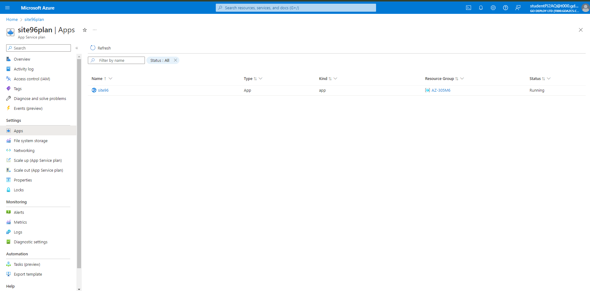
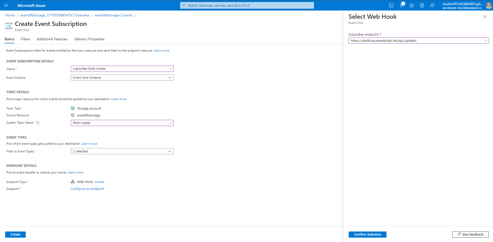

Module 06: Event triggers and event handling
In this lab, you use the Azure portal to do the following tasks:

Create a Blob storage account.
Subscribe to events for that blob storage.
Trigger an event by uploading a file to the blob storage.
View the result in a handler web app. Typically, you send events to an endpoint that processes the event data and takes actions. To keep it simple, you send events to a web app that collects and displays the messages.

When you're finished, you see that the event data has been sent to the web app.

Task 1: Create a storage account
If necessary, log into CLIENT1 with the username Admin and password Pa55w.rd

Open a browser and navigate to the following URL: https://portal.azure.com.

Log into the Azure Portal with the username studentPJ2AQ@t000.gdazcs.com and password Yk2qfPE0qMCwEPWv.

To create a Blob storage, select Create a resource.

In the Search, enter Storage account, and select Storage account from the result list.

On the Storage account page, select Create to start creating the storage account. To subscribe to events, create either a general-purpose v2 storage account or a Blob storage account.

On the Create storage account page, do the following steps:

Select your Azure subscription, CS-SUB-0299.

For Resource group, select AZ-305M6 from the drop-down list.

Enter the name for your storage account.

For Region, select (US) East US.

For Redundancy, select Locally-redundant storage (LRS) from the drop-down list.

Select Review at the bottom of the page.

On the Review page, review the settings, and select Create.

The deployment takes a few minutes to complete. On the Deployment page, select Go to resource.

On the Storage account page, select Events on the left menu.

Keep this page in the web browser open.

Task 2: Create a message endpoint
Before subscribing to the events for the Blob storage, let's create the endpoint for the event message. Typically, the endpoint takes actions based on the event data. To simplify this quickstart, you deploy a prebuilt web app that displays the event messages. The deployed solution includes an App Service plan, an App Service web app, and source code from GitHub.

Insert this URL into Edge to deploy a template for the eventgrid webapp https://portal.azure.com/#create/Microsoft.Template/uri/https%3A%2F%2Fraw.githubusercontent.com%2FAzure-Samples%2Fazure-event-grid-viewer%2Fmaster%2Fazuredeploy.json.

On the Custom deployment page, do the following steps:

For Resource group, select the resource group AZ-305M6. It will be easier for you to clean up after you're done with the tutorial by deleting the resource group.

For Site Name, enter a name for the web app. (unique)

For Hosting plan name, enter a name for the App Service plan to use for hosting the web app. (unique)

For Sku, select F1.

Select Review + create.

On the Review + create page, select Create.

The deployment takes a few minutes to complete. On the Deployment page, select Go to resource group.

On the Resource group page, in the list of resources, select the web app that you created. You also see the App Service plan and the storage account in this list.

On the App Service page for your web app, select the URL to navigate to the web site. The URL should be in this format: https://.azurewebsites.net. Take note of this URL so you can return to it later.

Confirm that you see the site but no events have been posted to it yet.

Task 3: Subscribe to the Blob storage
You subscribe to a topic to tell Event Grid which events you want to track, and where to send the events.

If you closed the Storage account page, navigate to your Azure Storage account that you created earlier. On the left menu, select All resources and select your storage account.

On the Storage account page, select Events on the left menu.

Select More Options, and Web Hook. You're sending events to your viewer app using a web hook for the endpoint.

On the Create Event Subscription page, do the following steps:

Enter a name for the event subscription.

Enter a name for the system topic.

Select Web Hook for Endpoint type.

For Endpoint, choose Select an endpoint, and enter the URL of your web app and add api/updates to the home page URL (for example: https://spegridsite.azurewebsites.net/api/updates, and then select Confirm Selection.

Now, on the Create Event Subscription page, select Create to create the event subscription.

View your web app again, and notice that a subscription validation event has been sent to it. Select the eye icon to expand the event data. Event Grid sends the validation event so the endpoint can verify that it wants to receive event data. The web app includes code to validate the subscription.

Now, let's trigger an event to see how Event Grid distributes the message to your endpoint.

Task 4: Send an event to your endpoint
You trigger an event for the Blob storage by uploading a file. The file doesn't need any specific content.

In the Azure portal, navigate to your Blob storage account, and select Containers on the let menu.

Select + Container. Give your container a name, and use any access level, and select Create.

Select your new container.

To upload a file, select Upload. On the Upload blob page, browse and select a file that you want to upload for testing, and then select Upload on that page.

Browse to your test file and upload it.

You've triggered the event, and Event Grid sent the message to the endpoint you configured when subscribing. The message is in the JSON format and it contains an array with one or more events. In the following example, the JSON message contains an array with one event. View your web app and notice that a blob created event was received.

