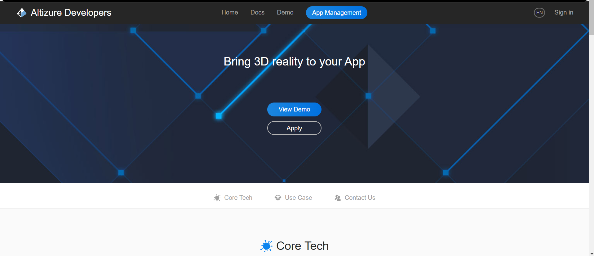

This is my first technical internship in 2018 winter to write a website for altizure sdk for third party developers. Altizure provides third party API to do 3D reconstruction and the website I worked on gives introduction, use cases, apply form, login form and configuration form. I worked closely with designers and backend engineers and completed the whole frontend part on my own within the winter semester. The website uses react, nextjs, rebase and support responsive design.

However the services is ended and the website is no longer live. Only one web archive snapshot is available.
