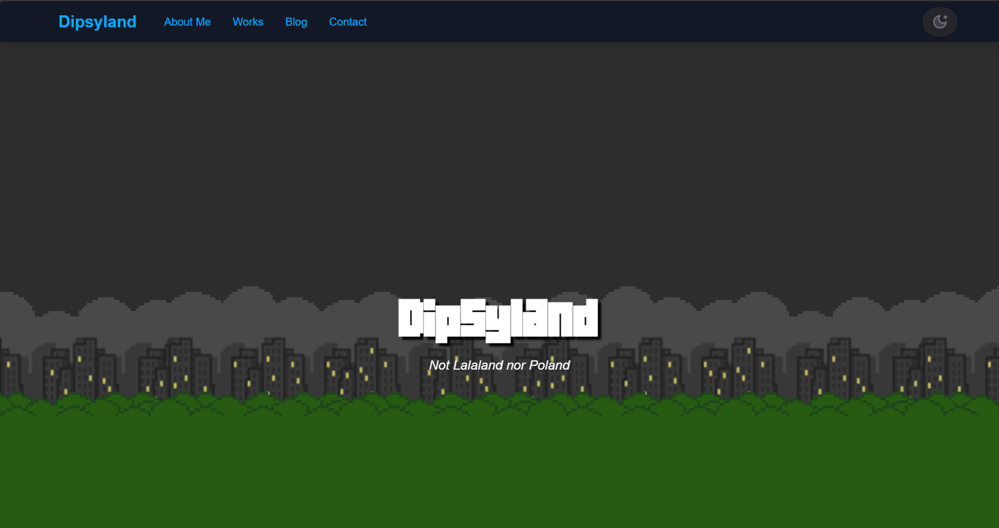

I rebuilt my personal website from almost scratch.

## Why?

1. Vue2 is EoL and I dont want to pick up Vue3
1. Poor SEO, content are dynamic generated after page load
1. I want to build interactive blog post with mdx (potentially jupyter notebook)
1. I want dark theme

## How?

1. Migrated to Next.js
1. Use static site generation (SSG) to pregenerate all route to each blog post, that is search engine friendly
1. Add mdx support
1. The template I used come with tailwind, there is theme switch built-in

## What did I do?

1. Clone a template, which is quite nice `https://github.com/ChangoMan/nextjs-mdx-blog`
1. Fix the caveats within the template (like yarn is more preferrable)
1. Translate the vue pug html templates into tsx, and decide what features to drop
1. Copy paste the scss (would be long way to switch from scss to tailwind, not sure if that will really worth it)
1. Script to download all blog posts to the repo
1. Set up mdx
1. Implemented dark theme, draw the background iamge in dark theme
1. Implemented Nextjs specific stuff, like meta data, layouts, etc
1. Clean up blog posts to align new structure and design.
1. Now I need to rethink the high level design, how can I present my data in a more fluent way
1. I migrated my domain from namecheap to cloudflare, saved me a lunch each year. But I have to change my DNS as well so there were some chaos on the migration day (for example cloudflare enfore HTTPS and proxy to github page HTTP, but github page try to redirect to HTTPS which lead it back to cloudflare, the solution was to keep cloudflare to github connection secure)

## What are the benefits?

1. Dont need to maintain legacy Vue2
1. Better SEO
1. Cool dark theme
1. Interactive blog post - [example - set up NginX](https://dipsy.me/posts/Setup-new-subdomain-on-NginX-with-redirected-SSL/)

## TODO

Design better arrangement of the website, how to arrange my works, my blog, and my details, prevent the use of additional yaml file.
