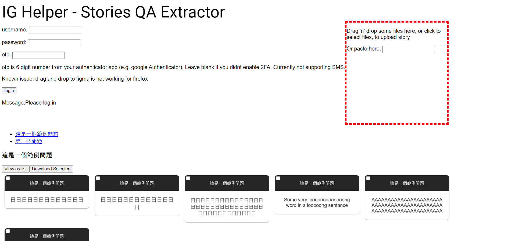

It is very cumbersome to manage ig story Q and A on phone, at the same time Q and A is not supported on ig web, so i made this to make my life easier in doing Q and A using IG story. I almost got blocked by ig so this project is abandoned.

