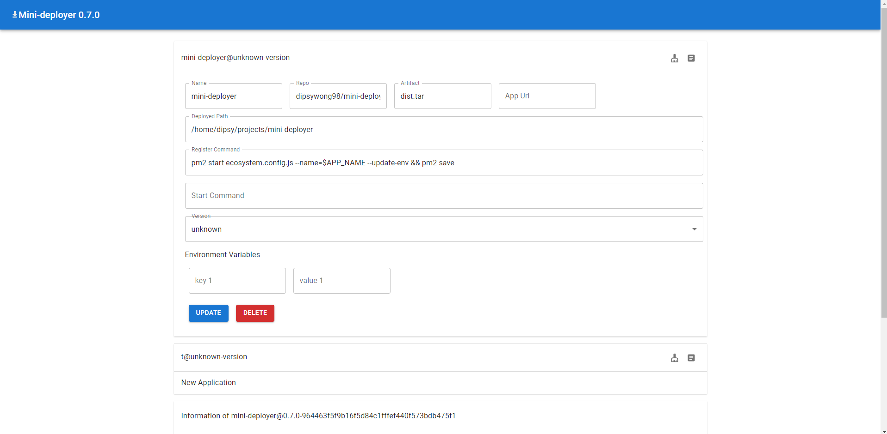

## Story

A simple deployer that deploy applications to a single server. Making this because k8s is expensive and overkill when i dont have that many and huge projects to deploy. Deployment to multiple server will need to have mini-deployer available in all the servers, and trigger deployment to each of them. This mini-deployer is meant to be small and target for deploying mini personal projects only.

