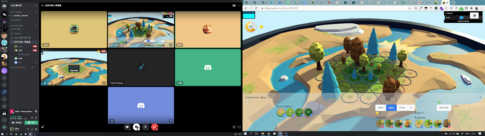

# Photosynthesis
> An online boardgame photosynthesis made for Katrin
> Authors: [Dipsy Wong](//github.com/dipsywong98), [Daniel Cheung](//github.com/danvim)

[Play now!](https://dipsywong98.github.io/photosynthesis/)

## Game Rules

<iframe width="560" height="315" src="https://www.youtube.com/embed/a84AJ5ht_ng" frameborder="0" allow="accelerometer; autoplay; clipboard-write; encrypted-media; gyroscope; picture-in-picture" allowfullscreen></iframe>
