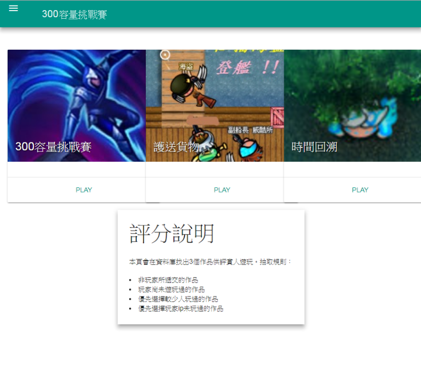
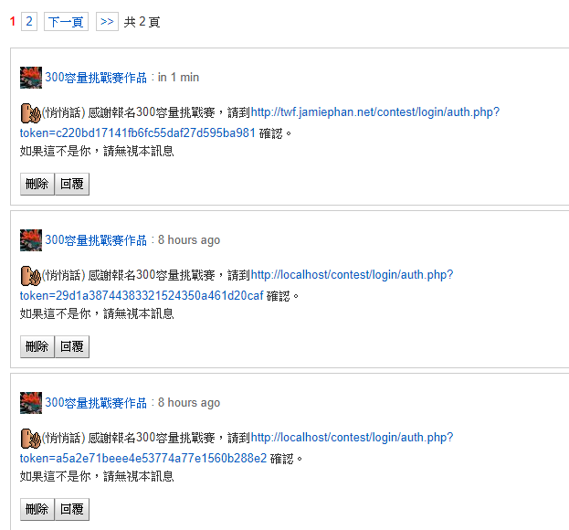
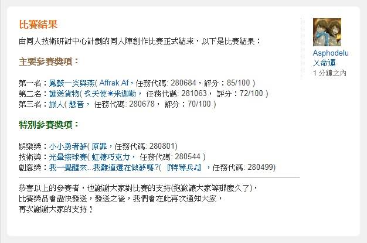

This is the only event organized in twftechnique, a website founded by me to share techniques in creating games using mission editor within the game Twilight War. The mission editor has a limited size in game creation - only 300 actions for free version. The competition aimed to show that even with that limitation, we can still make high quality games. This is as well my first web fullstack project, which was using PHP and mysql.

The code is terrible and did not have a proper readme on project set up.

