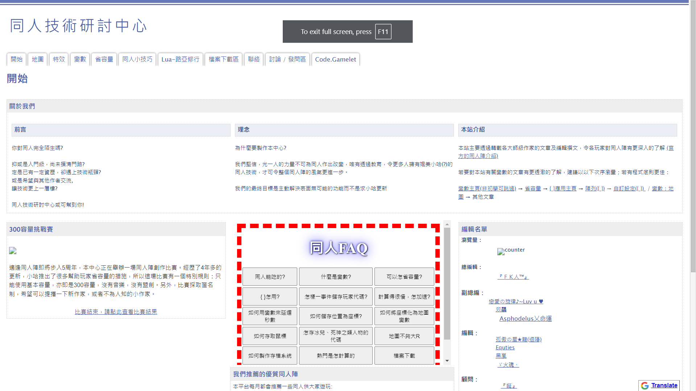
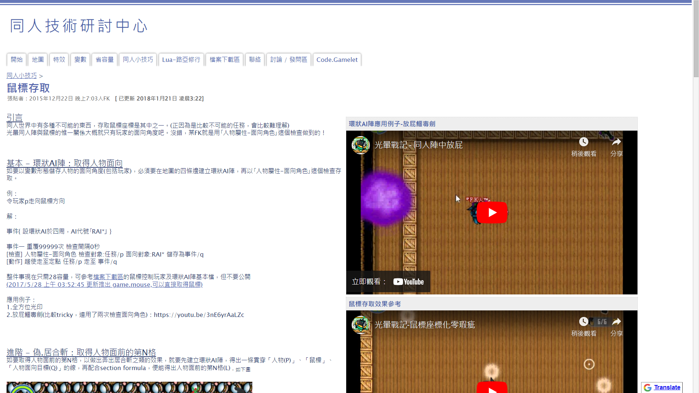

Contains over 70 articles on techniques using Twilight Wars campaign maker to make custom games. I founded the team and coauth the articles with other experienced maker in the community. It has been the largest and most frequently referenced tutorial website in the community. The techniques covers map making, variables, effects, hacks and maths in making games and the website has a very possitive impression in the community.

It was made in old google sites which was deprecated by google. Here is a backup of the website https://dipsy.me/twftechnique/home.html .

Homepage

The technique that I am most proud of is accessing cursor position. There was no native support on getting the cursor position, I have to utilize math knowledge in high school to achieve that, for example section formular, Cramer's rule.
