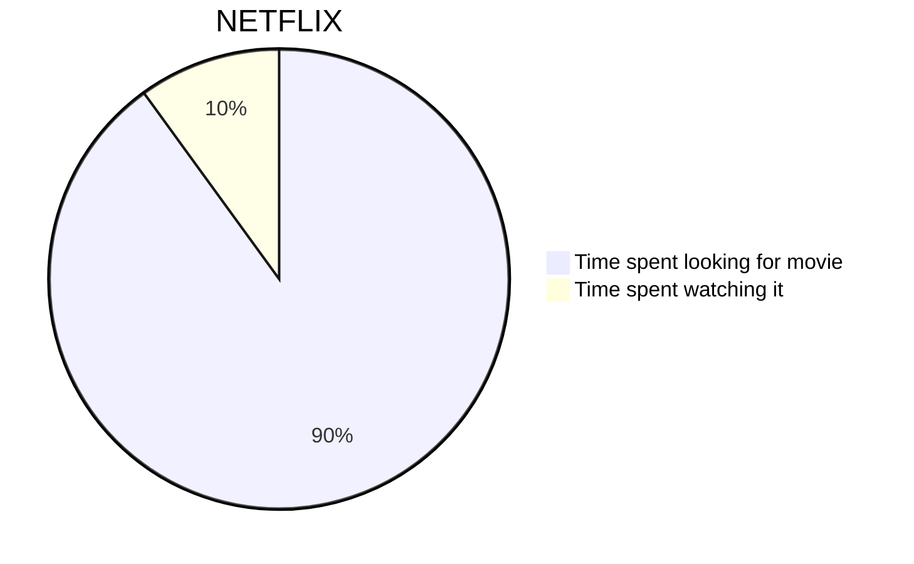

import {WEBSITE_HOST_URL} from '@/lib/constants'

export const meta = {
  title: 'About Me',
  description: 'I like to blog about web development',
  url: `${WEBSITE_HOST_URL}/about`,
}

export const metadata = {
  title: meta.title,
  description: meta.description,
  openGraph: {
    title: meta.title,
    description: meta.description,
    url: meta.url,
  },
  twitter: {
    title: meta.title,
    description: meta.description,
  },
  alternates: {
    canonical: meta.url,
  },
}

Currently I am working as a software engineer in a bank. Here are what I am doing in my job:

- Data engineering - Python(Prefect), Clojure(Spark)
- Fullstack development - Python(FastAPI), TypeScript(Express, React)
- Database - Clickhouse, Mongo, Elasticsearch
- DevOps - Kubernetes, Ansible, Gitlab CI
- Monitoring - Prometheus, Opentelemetry, Tempo, Grafana
- Last but not least, send emails! For sure the best part!

Before working I was studying in HKUST majoring in Computer Science and Maths, with a minor in Robotics.

## Hobbies

What you see here is my hobby. Who will build a beatiful(?) website after work without getting paid? And it is not really helpful in job seeking because most people would rather look for a resume (especially I was more often seen as a backend guy lol)

I love making random projects, they are not nessessary in the best quality or super useful, but there is always joy in building them. [Click me](/#works) to see all my works.

My other hobbies include calligraphy, playing games and learning random stuffs.

## Fun facts about me

1. I named myself Dipsy when I was in kindergarten because I loved watching Teletubbies. If you ask me why I picked Dipsy, I really have no idea...

1. I made up the term Dipsyland during my Form 4 VA project ideation process to joke on Disneyland, and it is 2 years before the movie Lalaland and the meme.

1. I was well known back in high school for being a "Tai Chi master", but the fact is, I already forget all the moves...

